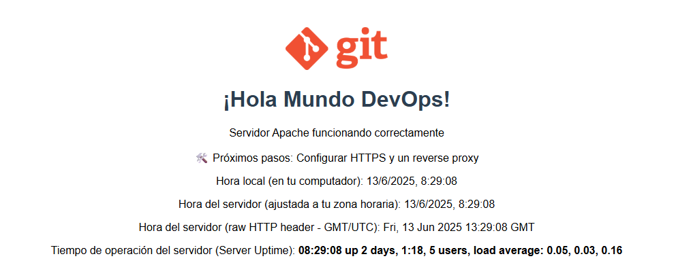
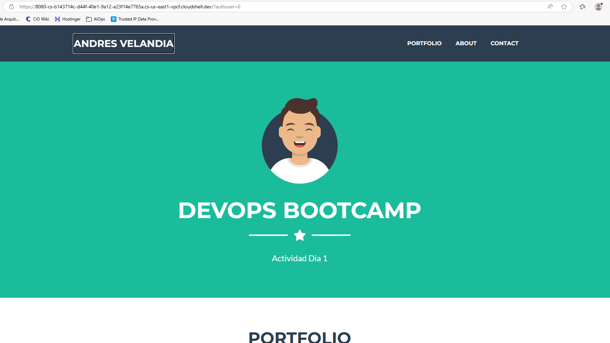

<span style="color:blue;font-weight:700;font-size:20px">
    <h1>
        DÍA 1
    </h1>
</span>

<span style="color:green;font-weight:700;font-size:18px">
    <h2>
       Motivación
    </h2>
</span>

Hay varios factores para querer hacer este Bootcamp:
- Curiosidad intelectual y profesional.
- Agregar el componente técnico a un ciclo que inicié hace 6 meses, liderando la adopción de DevOps en la empresa en que trabajaba antes.
- ¿Oportunidad de mejor trabajo? ¿Por qué no?
- Buen uso del tiempo libre.

<span style="color:green;font-weight:700;font-size:18px">
    <h2>
       Entorno de trabajo
    </h2>
</span>

- Estoy usando el siguiente esquema de trabajo:
```Ubuntu Linux directory``` -> ```WSL``` -> ```Windows 11```

- Estoy accediendo al directorio Linux desde el Visual Studio Code en Windows.
- Estoy usando una cuenta propia en Github.

<span style="color:green;font-weight:700;font-size:18px">
    <h2>
       Tareas completadas
    </h2>
</span>

- Clonar repositorio de Rox con ```git``` desde Linux.
- Conectar VS Code con el directorio de Linux que contiene el proyecto clonado.

<span style="color:green;font-weight:700;font-size:18px">
    <h2>
       Estructura original del proyecto
    </h2>
</span>

```console
╭─clansman at laptop in ~/projects 25-06-11 - 15:49:55
╰─○ eza -Tlah roxs-devops-project90/roxs-voting-app
Permissions Size User     Date Modified Name
drwxr-xr-x     - clansman 11 Jun 15:44  roxs-devops-project90/roxs-voting-app
drwxr-xr-x     - clansman 11 Jun 15:44  ├── load-testing
.rw-r--r--  8.6k clansman 11 Jun 15:44  │  └── k6.js
drwxr-xr-x     - clansman 11 Jun 15:44  ├── result
.rw-r--r--     8 clansman 11 Jun 15:44  │  ├── .nvmrc
.rw-r--r--  6.3k clansman 11 Jun 15:44  │  ├── main.js
.rw-r--r--   822 clansman 11 Jun 15:44  │  ├── package.json
drwxr-xr-x     - clansman 11 Jun 15:44  │  ├── tests
.rw-r--r--   134 clansman 11 Jun 15:44  │  │  └── main.test.js
drwxr-xr-x     - clansman 11 Jun 15:44  │  └── views
.rw-r--r--  6.1k clansman 11 Jun 15:44  │     ├── .DS_Store
.rw-r--r--  5.1k clansman 11 Jun 15:44  │     ├── index.html
drwxr-xr-x     - clansman 11 Jun 15:44  │     ├── js
.rw-r--r--  151k clansman 11 Jun 15:44  │     │  ├── angular.min.js
.rw-r--r--  5.1k clansman 11 Jun 15:44  │     │  ├── app.js
.rw-r--r--   50k clansman 11 Jun 15:44  │     │  └── socket.io.js
drwxr-xr-x     - clansman 11 Jun 15:44  │     └── stylesheets
.rw-r--r--   16k clansman 11 Jun 15:44  │        └── style.css
drwxr-xr-x     - clansman 11 Jun 15:44  ├── vote
.rw-r--r--  8.4k clansman 11 Jun 15:44  │  ├── app.py
.rw-r--r--   167 clansman 11 Jun 15:44  │  ├── requirements.txt
drwxr-xr-x     - clansman 11 Jun 15:44  │  ├── templates
.rw-r--r--   25k clansman 11 Jun 15:44  │  │  └── index.html
drwxr-xr-x     - clansman 11 Jun 15:44  │  └── tests
.rw-r--r--   468 clansman 11 Jun 15:44  │     ├── lint_test.py
.rw-r--r--   250 clansman 11 Jun 15:44  │     └── test_app.py
drwxr-xr-x     - clansman 11 Jun 15:44  └── worker
.rw-r--r--     8 clansman 11 Jun 15:44     ├── .nvmrc
.rw-r--r--  7.5k clansman 11 Jun 15:44     ├── main.js
.rw-r--r--   561 clansman 11 Jun 15:44     ├── package.json
drwxr-xr-x     - clansman 11 Jun 15:44     └── tests
.rw-r--r--   125 clansman 11 Jun 15:44        └── main.test.js
```
******************
<span style="color:blue;font-weight:700;font-size:20px">
    <h1>
        DÍA 2
    </h1>
</span>

<span style="color:green;font-weight:700;font-size:18px">
    <h2>
       Instalación de nginx y apache
    </h2>
</span>

He instalado aplicaciones en Linux muchas veces en mi vida. Sin embargo, estas instalaciones fueron especiales.

<span style="color:red;font-weight:700;font-size:18px">
    <h3>
       nginx
    </h3>
</span>
- Esta aplicación fue instalada correctamente, y en el archivo de configuración `/etc/nginx/nginx.conf` aparecen las rutas en donde se buscarán los archivos `index`: `/etc/nginx/sites-enabled/` y `/etc/nginx/conf.d/` 
- En la primera de estas 2 rutas se hace referencia a la directiva **`index`**, en la cual se instancian varios archivos que pueden ser los `index` mencionados antes:

```console
 root /var/www/html;

 # Add index.php to the list if you are using PHP
 index index.html index.htm index.nginx-debian.html;
  ```

- Se hace referencia también a la ruta desde donde leer ese archivo; para este caso, la ruta es `/var/www/html/`. 
- Se revisa allí y se encuentra el archivo `index.nginx-debian.html`, por lo cual modifiqué esta directiva así:

```console
 root /var/www/html;

 # Add index.php to the list if you are using PHP
  index index.nginx-debian.html;
 ```
 - Probé exitosamente con `curl localhost`, sin especificar un puerto TCP. EL servicio atiende por el puerto TCO 80,estándar para páginas web.

<span style="color:red;font-weight:700;font-size:18px">
    <h3>
       apache2
    </h3>
</span>
- Este servicio fue instalado fácilmente, pero encontré el primer error al intentar habilitarlo; no puedo crear el socket, porque el puerto TCP 80 ya está atado a las direcciones 0.0.0.0 y [::]: 

```console
journalctl| grep apache
Jun 12 10:30:49 AuditorTec sudo[13373]: clansman : TTY=pts/0 ; PWD=/home/clansman ; USER=root ; COMMAND=/usr/bin/apt install apache
Jun 12 10:30:55 AuditorTec sudo[13399]: clansman : TTY=pts/0 ; PWD=/home/clansman ; USER=root ; COMMAND=/usr/bin/apt install apache2
Jun 12 10:31:27 AuditorTec systemd[1]: Starting apache2.service - The Apache HTTP Server...
Jun 12 10:31:27 AuditorTec apachectl[13968]: (98)Address already in use: AH00072: make_sock: could not bind to address [::]:80
Jun 12 10:31:27 AuditorTec apachectl[13968]: (98)Address already in use: AH00072: make_sock: could not bind to address 0.0.0.0:80
Jun 12 10:31:27 AuditorTec apachectl[13968]: no listening sockets available, shutting down
```
- Solución: elegí configurar **Apache** para escuchar en el puerto TCP 8080 y **nginx** en el puerto TCP 80.

<span style="color:red;font-weight:700;font-size:18px">
    <h3>
       Permisos
    </h3>
</span>

- Los permisos fueron configurados correctamente, tanto para los directorios de la ruta `/var/www/html/` como para los archivos allí guardados, usando `chown`.
- Esta configuración de permisos es crucial, porque es una buena práctica de seguridad: 
    - por defecto, tanto `nginx` como apache se ejecutan con el usuario `www-data`, que no es privilegiado, en lugar de hacerlo con `root`. 
    - Sin embargo, la ruta mencionada y los archivos allí almacenados son propiedad del usuario `root` y el grupo `rootv, por defecto.
    - al cambiar la propiedad (755 para directorios y 644 para archivos), el usuario `www-data` queda con los permisos como se ven en la evidencia y se disminuye la superficie de ataque si se llegaran a comprometer las credenciales de dicho usuario:

```console
╰─○ eza -ld /var/www/html
drwxr-xr-x - www-data 12 Jun 10:31 /var/www/html
```

```console
╰─○ eza -lh /var/www/html
Permissions Size User     Date Modified Name
.rw-r--r--   11k www-data 12 Jun 10:31  index.html
.rw-r--r--   615 www-data 12 Jun 09:24  index.nginx-debian.html
```

<span style="color:red;font-weight:700;font-size:18px">
    <h3>
       Acceder al sitio
    </h3>
</span>

- Tuve que incluir una etiqueta al código HTML de la página de inicio, dentro de la sección <**head**> para que muestre bien los caracteres y símbolos:
```html
 <meta charset="UTF-8">
```
- UTF es el acrónimo de Unicode Transformation Format, en el cual '8' quiere decir que se usan bloques de 8 bits para representar un caracter / símbolo.
 
<span style="color:red;font-weight:700;font-size:18px">
    <h3>
       Reto adicional
    </h3>
</span>

El reto original consiste en mostrar:

- La hora del servidor (usando JavaScript). Mi solución es la siguiente:
```javascript
 <script>
        // 1. Mostrar el tiempo local del cliente
        document.getElementById('clientTime').innerText = new Date().toLocaleString();

        // 2. Funcion para tomar y mostrar el tiempo del servidor desde los encabezados HTTP.
        function fetchServerTime() {
            // Solicitud a la pagina, pero solamente los encabezados (metodo HEAD), para no descargar toda la pagina.

            fetch(window.location.href, { method: 'HEAD' })
                .then(response => {
                    // Obtener 'Date' de la respuesta del servidor.
                    const dateHeader = response.headers.get('Date');

                    if (dateHeader) {
                        // 'Date' siempre va en formato GMT/UTC ("Thu, 12 Jun 2025 20:23:27 GMT").
                        // Cuando se analiza en `new Date()`, JavaScript automaticamente la convierte a la zona horaria local del cliente.
                        const serverDate = new Date(dateHeader);

                        // Mostrar el tiempo del servidor ya ajustado.
                        document.getElementById('serverTimeAdjusted').innerText = serverDate.toLocaleString();

                        // Mostrar el tiempo del servidor sin ser ajustado, raw.
                        document.getElementById('serverTimeRaw').innerText = dateHeader;
                    } else {
                        document.getElementById('serverTimeAdjusted').innerText = "No se encuentra el encabezado 'Date'.";
                        document.getElementById('serverTimeRaw').innerText = "N/A";
                    }
                })
                .catch(error => {
                    console.error('Error al tomar los encabezados:', error);
                    document.getElementById('serverTimeAdjusted').innerText = "Error al tomar el tiempo del servidor.";
                    document.getElementById('serverTimeRaw').innerText = "Error.";
                });
        }

        // Llamar la funcion cuando la pagina carga.
        fetchServerTime();

 </script>
```
- El resultado del comando uptime (requiere CGI). Mi solución es la siguiente:

Añadir esta sección:
```html
<p>Tiempo de operación del servidor (Server Uptime): <strong id="uptimeDisplay">Loading...</strong></p>
```

Y esta otra, que es el script de Javascript:
```javascript
// Tomar y mostrar el resultado de la ejecución del script uptime.cgi
        function fetchUptime() {
            // La propiedad window.location.origin en JavaScript proporciona el protocolo, el hostname, y el puerto de la URL y evita tener que configurar CORS.
            // Esto satisface la política Same-Origin.
            const uptimeUrl = window.location.origin + '/uptime.cgi';

            fetch(uptimeUrl)
                .then(response => {
                    if (!response.ok) {
                        throw new Error(`HTTP error! status: ${response.status}`);
                    }
                    return response.text(); 
                })
                .then(data => {
                    document.getElementById('uptimeDisplay').innerText = data.trim(); 
                })
                .catch(error => {
                    console.error('Error fetching uptime:', error);
                    document.getElementById('uptimeDisplay').innerText = `Failed to load uptime: ${error.message}`;
                });
        }

        fetchUptime();
```

<span style="color:red;font-weight:700;font-size:18px">
    <h3>
       Resultado Final
    </h3>
</span>



******************
<span style="color:blue;font-weight:700;font-size:20px">
    <h1>
        DÍA 3
    </h1>
</span>

<span style="color:green;font-weight:700;font-size:18px">
    <h2>
       Provisionamiento de Vagrant y Virtualbox
    </h2>
</span>

<span style="color:red;font-weight:700;font-size:18px">
    <h3>
       Google Cloud Shell
    </h3>
</span>

Primer despliegue en la nube:



<span style="color:red;font-weight:700;font-size:18px">
    <h3>
       Tarea Opcional Día 3 - Despliegue de página web en MV con Vagrant + nginx
    </h3>
</span>


******************
<span style="color:blue;font-weight:700;font-size:20px">
    <h1>
        DÍA 4
    </h1>
</span>

