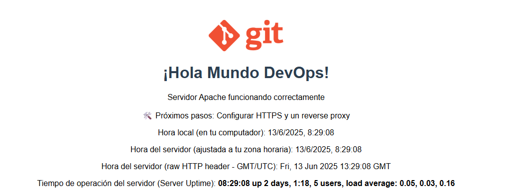
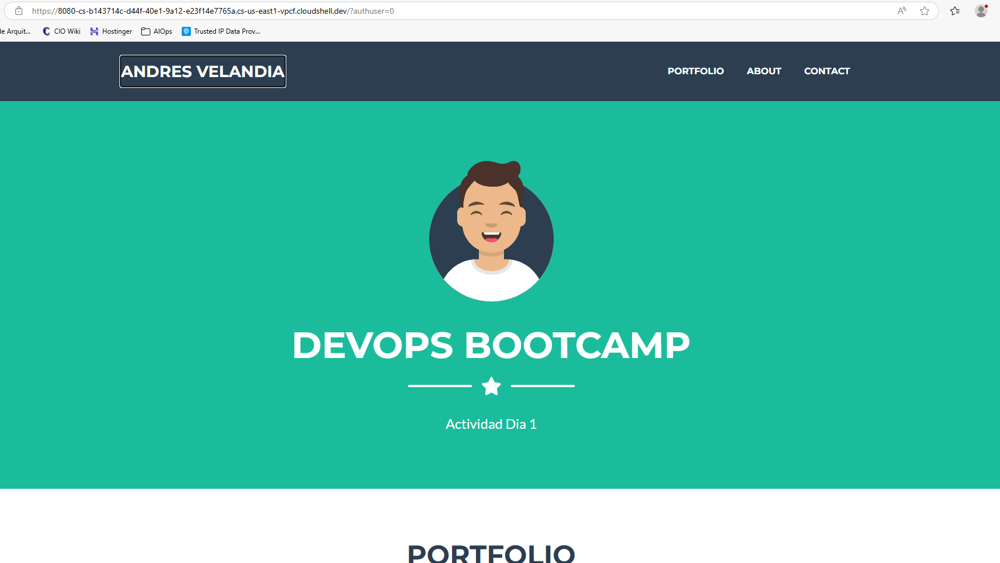
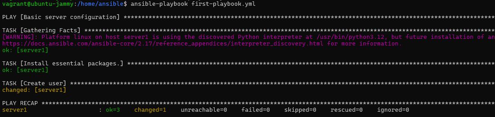
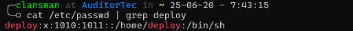
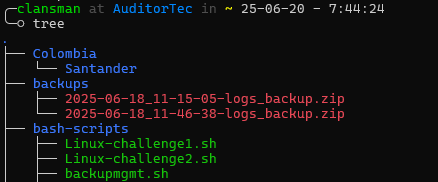
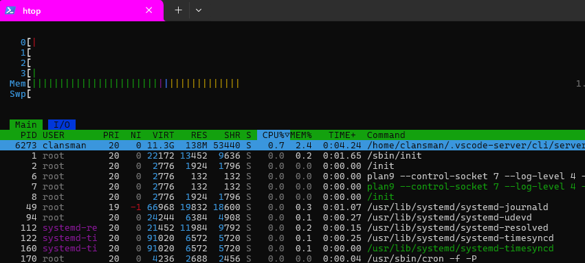
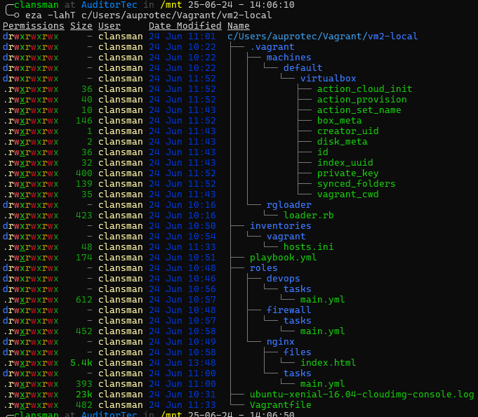
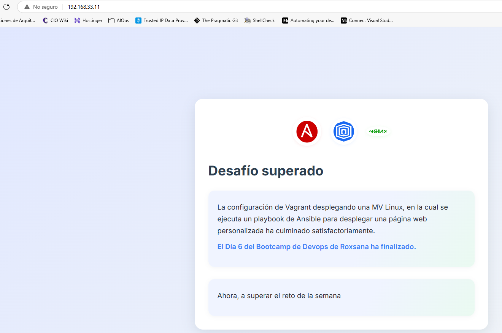
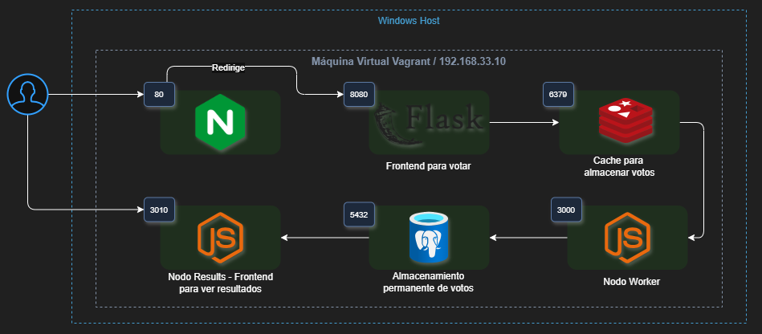
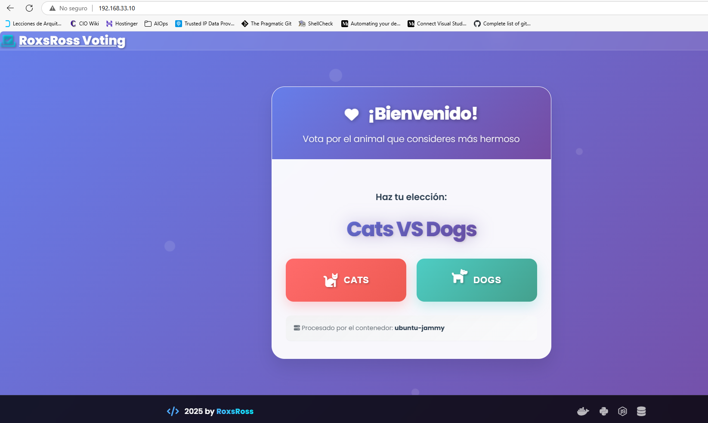

<span style="color:blue;font-weight:700;font-size:20px">
    <h1>
        DÍA 1. DevOps y la importancia de Linux
    </h1>
</span>

<span style="color:green;font-weight:700;font-size:18px">
    <h2>
       Motivación
    </h2>
</span>

Hay varios factores para querer hacer este Bootcamp:
- Curiosidad intelectual y profesional.
- Agregar el componente técnico a un ciclo que inicié hace 6 meses, liderando la adopción de DevOps en la empresa en que trabajaba antes.
- ¿Oportunidad de mejor trabajo? ¿Por qué no?
- Buen uso del tiempo libre.

<span style="color:green;font-weight:700;font-size:18px">
    <h2>
       Entorno de trabajo
    </h2>
</span>

- Estoy usando el siguiente esquema de trabajo:
```Ubuntu Linux directory``` -> ```WSL``` -> ```Windows 11```

- Estoy accediendo al directorio Linux desde el Visual Studio Code en Windows.
- Estoy usando una cuenta propia en Github.

<span style="color:green;font-weight:700;font-size:18px">
    <h2>
       Tareas completadas
    </h2>
</span>

- Clonar repositorio de Rox con ```git``` desde Linux.
- Conectar VS Code con el directorio de Linux que contiene el proyecto clonado.

<span style="color:green;font-weight:700;font-size:18px">
    <h2>
       Estructura original del proyecto
    </h2>
</span>

```console
╭─clansman at laptop in ~/projects 25-06-11 - 15:49:55
╰─○ eza -Tlah roxs-devops-project90/roxs-voting-app
Permissions Size User     Date Modified Name
drwxr-xr-x     - clansman 11 Jun 15:44  roxs-devops-project90/roxs-voting-app
drwxr-xr-x     - clansman 11 Jun 15:44  ├── load-testing
.rw-r--r--  8.6k clansman 11 Jun 15:44  │  └── k6.js
drwxr-xr-x     - clansman 11 Jun 15:44  ├── result
.rw-r--r--     8 clansman 11 Jun 15:44  │  ├── .nvmrc
.rw-r--r--  6.3k clansman 11 Jun 15:44  │  ├── main.js
.rw-r--r--   822 clansman 11 Jun 15:44  │  ├── package.json
drwxr-xr-x     - clansman 11 Jun 15:44  │  ├── tests
.rw-r--r--   134 clansman 11 Jun 15:44  │  │  └── main.test.js
drwxr-xr-x     - clansman 11 Jun 15:44  │  └── views
.rw-r--r--  6.1k clansman 11 Jun 15:44  │     ├── .DS_Store
.rw-r--r--  5.1k clansman 11 Jun 15:44  │     ├── index.html
drwxr-xr-x     - clansman 11 Jun 15:44  │     ├── js
.rw-r--r--  151k clansman 11 Jun 15:44  │     │  ├── angular.min.js
.rw-r--r--  5.1k clansman 11 Jun 15:44  │     │  ├── app.js
.rw-r--r--   50k clansman 11 Jun 15:44  │     │  └── socket.io.js
drwxr-xr-x     - clansman 11 Jun 15:44  │     └── stylesheets
.rw-r--r--   16k clansman 11 Jun 15:44  │        └── style.css
drwxr-xr-x     - clansman 11 Jun 15:44  ├── vote
.rw-r--r--  8.4k clansman 11 Jun 15:44  │  ├── app.py
.rw-r--r--   167 clansman 11 Jun 15:44  │  ├── requirements.txt
drwxr-xr-x     - clansman 11 Jun 15:44  │  ├── templates
.rw-r--r--   25k clansman 11 Jun 15:44  │  │  └── index.html
drwxr-xr-x     - clansman 11 Jun 15:44  │  └── tests
.rw-r--r--   468 clansman 11 Jun 15:44  │     ├── lint_test.py
.rw-r--r--   250 clansman 11 Jun 15:44  │     └── test_app.py
drwxr-xr-x     - clansman 11 Jun 15:44  └── worker
.rw-r--r--     8 clansman 11 Jun 15:44     ├── .nvmrc
.rw-r--r--  7.5k clansman 11 Jun 15:44     ├── main.js
.rw-r--r--   561 clansman 11 Jun 15:44     ├── package.json
drwxr-xr-x     - clansman 11 Jun 15:44     └── tests
.rw-r--r--   125 clansman 11 Jun 15:44        └── main.test.js
```
******************
<span style="color:blue;font-weight:700;font-size:20px">
    <h1>
        DÍA 2. Introducción a Linux y la terminal.
    </h1>
</span>

<span style="color:green;font-weight:700;font-size:18px">
    <h2>
       Instalación de nginx y apache
    </h2>
</span>

He instalado aplicaciones en Linux muchas veces en mi vida. Sin embargo, estas instalaciones fueron especiales.

<span style="color:red;font-weight:700;font-size:18px">
    <h3>
       nginx
    </h3>
</span>
- Esta aplicación fue instalada correctamente, y en el archivo de configuración `/etc/nginx/nginx.conf` aparecen las rutas en donde se buscarán los archivos `index`: `/etc/nginx/sites-enabled/` y `/etc/nginx/conf.d/` 
- En la primera de estas 2 rutas se hace referencia a la directiva **`index`**, en la cual se instancian varios archivos que pueden ser los `index` mencionados antes:

```console
 root /var/www/html;

 # Add index.php to the list if you are using PHP
 index index.html index.htm index.nginx-debian.html;
  ```

- Se hace referencia también a la ruta desde donde leer ese archivo; para este caso, la ruta es `/var/www/html/`. 
- Se revisa allí y se encuentra el archivo `index.nginx-debian.html`, por lo cual modifiqué esta directiva así:

```console
 root /var/www/html;

 # Add index.php to the list if you are using PHP
  index index.nginx-debian.html;
 ```
 - Probé exitosamente con `curl localhost`, sin especificar un puerto TCP. EL servicio atiende por el puerto TCO 80,estándar para páginas web.

<span style="color:red;font-weight:700;font-size:18px">
    <h3>
       apache2
    </h3>
</span>
- Este servicio fue instalado fácilmente, pero encontré el primer error al intentar habilitarlo; no puedo crear el socket, porque el puerto TCP 80 ya está atado a las direcciones 0.0.0.0 y [::]: 

```console
journalctl| grep apache
Jun 12 10:30:49 AuditorTec sudo[13373]: clansman : TTY=pts/0 ; PWD=/home/clansman ; USER=root ; COMMAND=/usr/bin/apt install apache
Jun 12 10:30:55 AuditorTec sudo[13399]: clansman : TTY=pts/0 ; PWD=/home/clansman ; USER=root ; COMMAND=/usr/bin/apt install apache2
Jun 12 10:31:27 AuditorTec systemd[1]: Starting apache2.service - The Apache HTTP Server...
Jun 12 10:31:27 AuditorTec apachectl[13968]: (98)Address already in use: AH00072: make_sock: could not bind to address [::]:80
Jun 12 10:31:27 AuditorTec apachectl[13968]: (98)Address already in use: AH00072: make_sock: could not bind to address 0.0.0.0:80
Jun 12 10:31:27 AuditorTec apachectl[13968]: no listening sockets available, shutting down
```
- Solución: elegí configurar **Apache** para escuchar en el puerto TCP 8080 y **nginx** en el puerto TCP 80.

<span style="color:red;font-weight:700;font-size:18px">
    <h3>
       Permisos
    </h3>
</span>

- Los permisos fueron configurados correctamente, tanto para los directorios de la ruta `/var/www/html/` como para los archivos allí guardados, usando `chown`.
- Esta configuración de permisos es crucial, porque es una buena práctica de seguridad: 
    - por defecto, tanto `nginx` como apache se ejecutan con el usuario `www-data`, que no es privilegiado, en lugar de hacerlo con `root`. 
    - Sin embargo, la ruta mencionada y los archivos allí almacenados son propiedad del usuario `root` y el grupo `rootv, por defecto.
    - al cambiar la propiedad (755 para directorios y 644 para archivos), el usuario `www-data` queda con los permisos como se ven en la evidencia y se disminuye la superficie de ataque si se llegaran a comprometer las credenciales de dicho usuario:

```console
╰─○ eza -ld /var/www/html
drwxr-xr-x - www-data 12 Jun 10:31 /var/www/html
```

```console
╰─○ eza -lh /var/www/html
Permissions Size User     Date Modified Name
.rw-r--r--   11k www-data 12 Jun 10:31  index.html
.rw-r--r--   615 www-data 12 Jun 09:24  index.nginx-debian.html
```

<span style="color:red;font-weight:700;font-size:18px">
    <h3>
       Acceder al sitio
    </h3>
</span>

- Tuve que incluir una etiqueta al código HTML de la página de inicio, dentro de la sección <**head**> para que muestre bien los caracteres y símbolos:
```html
 <meta charset="UTF-8">
```
- UTF es el acrónimo de Unicode Transformation Format, en el cual '8' quiere decir que se usan bloques de 8 bits para representar un caracter / símbolo.
 
<span style="color:red;font-weight:700;font-size:18px">
    <h3>
       Reto adicional
    </h3>
</span>

El reto original consiste en mostrar:

- La hora del servidor (usando JavaScript). Mi solución es la siguiente:
```javascript
 <script>
        // 1. Mostrar el tiempo local del cliente
        document.getElementById('clientTime').innerText = new Date().toLocaleString();

        // 2. Funcion para tomar y mostrar el tiempo del servidor desde los encabezados HTTP.
        function fetchServerTime() {
            // Solicitud a la pagina, pero solamente los encabezados (metodo HEAD), para no descargar toda la pagina.

            fetch(window.location.href, { method: 'HEAD' })
                .then(response => {
                    // Obtener 'Date' de la respuesta del servidor.
                    const dateHeader = response.headers.get('Date');

                    if (dateHeader) {
                        // 'Date' siempre va en formato GMT/UTC ("Thu, 12 Jun 2025 20:23:27 GMT").
                        // Cuando se analiza en `new Date()`, JavaScript automaticamente la convierte a la zona horaria local del cliente.
                        const serverDate = new Date(dateHeader);

                        // Mostrar el tiempo del servidor ya ajustado.
                        document.getElementById('serverTimeAdjusted').innerText = serverDate.toLocaleString();

                        // Mostrar el tiempo del servidor sin ser ajustado, raw.
                        document.getElementById('serverTimeRaw').innerText = dateHeader;
                    } else {
                        document.getElementById('serverTimeAdjusted').innerText = "No se encuentra el encabezado 'Date'.";
                        document.getElementById('serverTimeRaw').innerText = "N/A";
                    }
                })
                .catch(error => {
                    console.error('Error al tomar los encabezados:', error);
                    document.getElementById('serverTimeAdjusted').innerText = "Error al tomar el tiempo del servidor.";
                    document.getElementById('serverTimeRaw').innerText = "Error.";
                });
        }

        // Llamar la funcion cuando la pagina carga.
        fetchServerTime();

 </script>
```
- El resultado del comando uptime (requiere CGI). Mi solución es la siguiente:

Añadir esta sección:
```html
<p>Tiempo de operación del servidor (Server Uptime): <strong id="uptimeDisplay">Loading...</strong></p>
```

Y esta otra, que es el script de Javascript:
```javascript
// Tomar y mostrar el resultado de la ejecución del script uptime.cgi
        function fetchUptime() {
            // La propiedad window.location.origin en JavaScript proporciona el protocolo, el hostname, y el puerto de la URL y evita tener que configurar CORS.
            // Esto satisface la política Same-Origin.
            const uptimeUrl = window.location.origin + '/uptime.cgi';

            fetch(uptimeUrl)
                .then(response => {
                    if (!response.ok) {
                        throw new Error(`HTTP error! status: ${response.status}`);
                    }
                    return response.text(); 
                })
                .then(data => {
                    document.getElementById('uptimeDisplay').innerText = data.trim(); 
                })
                .catch(error => {
                    console.error('Error fetching uptime:', error);
                    document.getElementById('uptimeDisplay').innerText = `Failed to load uptime: ${error.message}`;
                });
        }

        fetchUptime();
```

<span style="color:red;font-weight:700;font-size:18px">
    <h3>
       Resultado Final
    </h3>
</span>



******************
<span style="color:blue;font-weight:700;font-size:20px">
    <h1>
        DÍA 3. Provisionamiento con Vagrant
    </h1>
</span>

<span style="color:green;font-weight:700;font-size:18px">
    <h2>
       Provisionamiento de Vagrant y Virtualbox
    </h2>
</span>

<span style="color:red;font-weight:700;font-size:18px">
    <h3>
       Google Cloud Shell
    </h3>
</span>

Primer despliegue en la nube:


<span style="color:red;font-weight:700;font-size:18px">
    <h3>
       Tarea Opcional Día 3 - Despliegue de página web en MV con Vagrant + nginx
    </h3>
</span>


******************
<span style="color:blue;font-weight:700;font-size:20px">
    <h1>
        DÍA 4. Git & Github - Basics
    </h1>
</span>

La tarea inicial de configurar Git fue más difícil de lo esperado. La razón es que elegí que mi repositorio de Github sea no solamente mi **remote origin** sino también que sea mi **upstream** repositorio.

Así mismo, la rama por defecto de Git en mi máquina Linux se llama **master** y la homóloga en Github se llama **main**.

La suma de estos 2 factores hacía que se genere un **fatal error** en Git al ejecutar `git push`:
```console
╰─⠠⠵ git push
fatal: The upstream branch of your current branch does not match
the name of your current branch.  To push to the upstream branch
on the remote, use

    git push origin HEAD:main

To push to the branch of the same name on the remote, use

    git push origin HEAD

To choose either option permanently, see push.default in 'git help config'.

To avoid automatically configuring an upstream branch when its name
won't match the local branch, see option 'simple' of branch.autoSetupMerge
in 'git help config'.
```
La solución consistió en:
- ejecutar `git push -u origin HEAD:main`, que quiere decir: suba al repositorio remoto, a la rama **main** lo que tiene en HEAD (que es lo que tengo en **master**) y haga que el upstream de **master** sea origin/main.
- ejecutar `git config --local push.default upstream`, que quiere decir: sólo para este repositorio (local), haga que el valor por defecto para subir cambios sea **upstream**, lo cual quiere decir en la práctica que al ejecutar `git push` sin argumentos, entienda que debe subir mis cambios a la rama que está configurada como upstream **_sin importar si los nombres coinciden_**.

******************
<span style="color:blue;font-weight:700;font-size:20px">
    <h1>
        DÍA 5. Automatizar con bash scripting.
    </h1>
</span>

Uno de los ejemplos que propone ROXS es el siguiente, para el monitoreo del uso de disco y la generación de alertas:

```shell
#!/bin/bash
ADMIN="admin@ejemplo.com"
USO_RAIZ=$(df / | grep / | awk '{print $5}' | sed 's/%//g')
TAMANO_HOME=$(du -sh /home | awk '{print $1}' | sed 's/G//g')

if [ "$USO_RAIZ" -ge 90 ]; then
    echo "¡Alerta: Partición / al ${USO_RAIZ}%!" | mail -s "Alerta Partición /" $ADMIN
fi

if (( $(echo "$TAMANO_HOME > 2" | bc -l) )); then
    echo "¡Alerta: /home ocupa ${TAMANO_HOME}GB!" | mail -s "Alerta Directorio /home" $ADMIN
fi
```
Una manera didáctica de ver claramente cómo está constituido el script es ver cómo se ejecuta cada parte del comando en el CLI de Linux.

Esta es la disección del primer comando, `df`:

```console
╭─clansman at AuditorTec in ~/bash-scripts 25-06-17 - 15:52:27
╰─○ df
Filesystem      1K-blocks      Used Available Use% Mounted on
none              2956296         0   2956296   0% /usr/lib/modules/5.15.167.4-microsoft-standard-WSL2
none              2956296         4   2956292   1% /mnt/wsl
drivers         499307516 132360736 366946780  27% /usr/lib/wsl/drivers
/dev/sdc       1055762868   3403748 998655648   1% /
none              2956296       132   2956164   1% /mnt/wslg
none              2956296         0   2956296   0% /usr/lib/wsl/lib
rootfs            2952804      2372   2950432   1% /init
none              2956296       544   2955752   1% /run
none              2956296         0   2956296   0% /run/lock
none              2956296         0   2956296   0% /run/shm
tmpfs                4096         0      4096   0% /sys/fs/cgroup
none              2956296        76   2956220   1% /mnt/wslg/versions.txt
none              2956296        76   2956220   1% /mnt/wslg/doc
C:\             499307516 132360736 366946780  27% /mnt/c
tmpfs              591256        16    591240   1% /run/user/1000
╭─clansman at AuditorTec in ~/bash-scripts 25-06-17 - 15:56:22
╰─○ df /
Filesystem      1K-blocks    Used Available Use% Mounted on
/dev/sdc       1055762868 3403748 998655648   1% /
╭─clansman at AuditorTec in ~/bash-scripts 25-06-17 - 15:56:37
╰─○ df | grep /dev/sdc
/dev/sdc       1055762868   3403748 998655648   1% /
╭─clansman at AuditorTec in ~/bash-scripts 25-06-17 - 15:57:06
╰─○ df | grep /dev/sdc | awk '{print $5}'
1%
╭─clansman at AuditorTec in ~/bash-scripts 25-06-17 - 15:57:43
╰─○ df | grep /dev/sdc | awk '{print $5}' | sed 's/%//g'
1
```
Esta es la disección del segundo comando, `du`:

```
╭─clansman at AuditorTec in ~/bash-scripts 25-06-17 - 16:17:57
╰─○ sudo du -sh /home
[sudo] password for clansman:
785M    /home
╭─clansman at AuditorTec in ~/bash-scripts 25-06-17 - 16:18:18
╰─○ sudo du -sh /home | awk '{print $1}'
785M
╭─clansman at AuditorTec in ~/bash-scripts 25-06-17 - 16:19:27
╰─○ sudo du -sh /home | awk '{print $1}' | sed 's/M//g'
785
```
<span style="color:red;font-weight:700;font-size:18px">
    <h3>
       Tareas Opcionales Día 5 - Construir shell scripts
    </h3>
</span>

**Solución Nivel 2**

🎯 *Objetivo:*

Crear un script que comprima el contenido de `/var/log`, lo guarde con timestamp en `/home/tu_usuario/backups/` y elimine backups de más de 7 días.

```shell
#!/bin/bash

if [ -n "$SUDO_USER" ]; then
    USER_HOME_DIR="/home/$SUDO_USER"
else
    USER_HOME_DIR="$HOME"
fi

# Script para comprimir y guardar archivos de logs en un directorio específico
FILENAME_TIMESTAMP=$(date "+%Y-%m-%d_%H-%M-%S")
SAVE_DIR="$USER_HOME_DIR/backups"
LOGS_DIR="/var/log/"
BACKUP_FILENAME="${FILENAME_TIMESTAMP}-logs_backup.zip"
FULL_BACKUP_PATH="$SAVE_DIR/$BACKUP_FILENAME"


echo "Iniciando proceso de compresión y guardado de archivos de $LOGS_DIR..."
mkdir -p "$SAVE_DIR"

zip -r -q $FULL_BACKUP_PATH $LOGS_DIR

if [ $? -eq 0 ]; then
    echo "Compresión exitosa. Archivo guardado en $FULL_BACKUP_PATH"
else
    echo "Error al comprimir los archivos."
    exit 1
fi

# Eliminar archivos de más de 7 días de creados
echo "Especifique los días de antigüedad de los archivos de respaldo a eliminar (por defecto 7 días):"
read -r DAYS
DAYS=${DAYS:-7}
find "$SAVE_DIR" -type f -name "*.zip" -mtime +"$DAYS" -exec rm {} \;
echo "Archivos de respaldo antiguos eliminados correctamente."
# Notificar la finalización de la tarea de borrado
echo "Proceso de respaldo completado. Los archivos comprimidos se encuentran en $SAVE_DIR."
exit 0
```
<span style="color:red;font-weight:700;font-size:18px">
    <h3>
       Reto del Día 5 - Construir shell scripts tipo "Devops Pro": Automatización + modularidad + validación
    </h3>
</span>

**Solución al desafío**

🎯 *Objetivo:*

Crear un script llamado `gestion_usuarios.sh` que permita:

- Crear un nuevo usuario pasando el nombre como argumento
- Validar si el usuario ya existe
- Registrar la acción en un log (`usuarios.log`)
- Usar una función llamada `crear_usuario` definida en un archivo `funciones.sh`

La función `crear_usuario`:
```shell 
#!/bin/bash

crear_usuario() {
echo "Ingrese el nombre del usuario que desea crear:"
read USERNAME

if [ -z "$USERNAME" ]; then
    echo "No se proporcionó un nombre de usuario."
    exit 1
fi

if id "$USERNAME" &>/dev/null; then
    echo "$(date '+%Y-%m-%d %H:%M:%S') - El usuario '$USERNAME' ya existe."
    exit 1
fi

# Crear el usuario
useradd "$USERNAME"
if [ $? -eq 0 ]; then
    echo "$(date '+%Y-%m-%d %H:%M:%S') - Usuario '$USERNAME' creado exitosamente."
else
    echo "$(date '+%Y-%m-%d %H:%M:%S') - Error al crear el usuario '$USERNAME'."
    exit 1
fi
# Establecer una contraseña para el usuario
echo "Establezca una contraseña para el usuario '$USERNAME':"
passwd "$USERNAME"
if [ $? -eq 0 ]; then
    echo "Contraseña establecida exitosamente para el usuario '$USERNAME'."
else
    echo "Error al establecer la contraseña para el usuario '$USERNAME'."
    exit 1
fi

# Crear el directorio home del usuario
USER_HOME_DIR="/home/$USERNAME"
mkdir -p "$USER_HOME_DIR"
if [ $? -eq 0 ]; then
    echo "Directorio home '$USER_HOME_DIR' creado exitosamente."
else
    echo "Error al crear el directorio home '$USER_HOME_DIR'."
    exit 1
fi  

# Cambiar la propiedad del directorio home al usuario 
chown "$USERNAME":"$USERNAME" "$USER_HOME_DIR"
if [ $? -eq 0 ]; then
    echo "Propiedad del directorio home '$USER_HOME_DIR' cambiada exitosamente al usuario '$USERNAME'."
else
    echo "Error al cambiar la propiedad del directorio home '$USER_HOME_DIR'."
    exit 1
fi

# Crear un archivo de bienvenida en el directorio home del usuario
WELCOME_FILE="$USER_HOME_DIR/welcome.txt"
echo "Bienvenido al sistema, $USERNAME!" > "$WELCOME_FILE"
if [ $? -eq 0 ]; then
    echo "Archivo de bienvenida '$WELCOME_FILE' creado exitosamente."
else
    echo "Error al crear el archivo de bienvenida '$WELCOME_FILE'."
    exit 1
fi

# Notificar al usuario de la creación exitosa
echo "$(date '+%Y-%m-%d %H:%M:%S') - Usuario '$USERNAME' creado exitosamente con su directorio home y archivo de bienvenida."  
# Exit the script
exit 0
}
# End of script
```

El script `gestion_usuarios.sh`:
```shell
#!/bin/bash

LOG_FILE="/var/log/user_creation.log"

# Ensure the log file exists
touch "$LOG_FILE" || { echo "Error al crear el archivo de registro '$LOG_FILE'."; exit 1;}  

# Set permissions for the log file
chmod 640 "$LOG_FILE" || { echo "Error al cambiar los permisos del archivo de registro '$LOG_FILE'."; exit 1;}  

# Redirect stdout and stderr to the log file; this will log all output and errors to the specified log file
exec > >(tee -a "$LOG_FILE") 2>&1

# Load the function to create a user
source ./function-create-user.sh

if [[ $# -ne 1 ]]; then
  echo "Error: Uso incorrecto. Se esperaba 1 argumento."
  echo "Uso: $0 <nombre_usuario>"
  exit 1
fi

USERNAME="$1"

# Call the user creation function
echo "$(date '+%Y-%m-%d %H:%M:%S') - Intentando crear usuario: '$USERNAME'..."

if crear_usuario "$USERNAME"; then
  # This message should ONLY be printed if the function succeeded
  echo "$(date '+%Y-%m-%d %H:%M:%S') - Usuario '$USERNAME' creado exitosamente."
else
  # This message should ONLY be printed if the function failed
  echo "$(date '+%Y-%m-%d %H:%M:%S') - Error al crear el usuario '$USERNAME'. Consultar log para detalles."
  exit 1 # Exit with error status if user creation failed
fi

# --- Final message for successful completion of the script ---
echo "$(date '+%Y-%m-%d %H:%M:%S') - Proceso de creación de usuario para '$USERNAME' finalizado."

exit 0
```
Lo que producen estos 2 scripts juntos:
```console
╰─○ sudo ./user-mgmt.sh juan           
2025-06-18 15:25:14 - Intentando crear usuario: 'juan'...
Ingrese el nombre del usuario que desea crear:
juan
2025-06-18 15:25:18 - Usuario 'juan' creado exitosamente.
Establezca una contraseña para el usuario 'juan':
New password: 
Retype new password: 
passwd: password updated successfully
Contraseña establecida exitosamente para el usuario 'juan'.
Directorio home '/home/juan' creado exitosamente.
Propiedad del directorio home '/home/juan' cambiada exitosamente al usuario 'juan'.
Archivo de bienvenida '/home/juan/welcome.txt' creado exitosamente.
2025-06-18 15:25:23 - Usuario 'juan' creado exitosamente con su directorio home y archivo de bienvenida.
```

Lo que se ve en el archivo de logs:
```console
2025-06-18 15:25:14 - Intentando crear usuario: 'juan'...
Ingrese el nombre del usuario que desea crear:
2025-06-18 15:25:18 - Usuario 'juan' creado exitosamente.
Establezca una contraseña para el usuario 'juan':
New password: 
Retype new password: 
passwd: password updated successfully
Contraseña establecida exitosamente para el usuario 'juan'.
Directorio home '/home/juan' creado exitosamente.
Propiedad del directorio home '/home/juan' cambiada exitosamente al usuario 'juan'.
Archivo de bienvenida '/home/juan/welcome.txt' creado exitosamente.
2025-06-18 15:25:23 - Usuario 'juan' creado exitosamente con su directorio home y archivo de bienvenida.
```
<span style="color:red;font-weight:700;font-size:18px">
    <h3>
       Reto del Día 5 - Bonus: despliegue automatizado de una aplicación Flask con nginx
    </h3>
</span>

**Solución al desafío**

🎯 *Objetivo:*

Crear un script llamado en shell que permita el despliegue de una aplicación Flask usando Gunicorn como servidor WSGI y Nginx como proxy reverso.

Muchas cosas por aprender de este desafío; en particular, que es relativamente fácil estandarizar el despliegue automático de aplicaciones: sumando este ejercicio a otras experiencias previas desplegando aplicaciones con otros stack tecnológicos como .NET con IIS, PHP con Apache, entre otros, empieza a emerger un patrón de tareas que se deben ejecutar para tener un despliegue exitoso. Obviamente, para cada stack tecnológico existen diferencias importantes.

A continuación, las evidencias.

*Logs de instalación y despliegue (solamente una sección de estos):*

```console
[2025-06-19 08:07:49 -0500] [37527] [INFO] Starting gunicorn 23.0.0
[2025-06-19 08:07:49 -0500] [37527] [INFO] Listening at: http://127.0.0.1:8000 (37527)
[2025-06-19 08:07:49 -0500] [37527] [INFO] Using worker: sync
[2025-06-19 08:07:49 -0500] [37529] [INFO] Booting worker with pid: 37529
[2025-06-19 08:07:49 -0500] [37530] [INFO] Booting worker with pid: 37530
[2025-06-19 08:07:49 -0500] [37531] [INFO] Booting worker with pid: 37531
[2025-06-19 08:07:49 -0500] [37532] [INFO] Booting worker with pid: 37532
Gunicorn está corriendo.
Configurando Nginx para servir la aplicación Flask...
server {
    listen 80;
    server_name _;
    location / {
        proxy_pass http://127.0.0.1:8000;
        proxy_set_header Host $host;
        proxy_set_header X-Real-IP $remote_addr;
        proxy_set_header X-Forwarded-For $proxy_add_x_forwarded_for;
        proxy_set_header X-Forwarded-Proto $scheme;
        proxy_redirect off;
}
    location /static/ {
        alias /home/clansman/bash-scripts/devops-static-web/static/;
        expires 30d;
        }

        access_log /var/log/nginx/booklibrary_access.log;
        error_log /var/log/nginx/booklibrary_error.log;
}
2025/06/19 08:07:52 [emerg] 37551#37551: open() "/etc/nginx/sites-enabled/booklibrary" failed (2: No such file or directory) in /etc/nginx/nginx.conf:60
nginx: configuration file /etc/nginx/nginx.conf test failed
Job for nginx.service failed.
See "systemctl status nginx.service" and "journalctl -xeu nginx.service" for details.
Nginx configurado exitosamente.
Verificando que los servicios estén activos...
✓ Nginx está corriendo.
✓ Gunicorn está corriendo
✓ Puerto 8000 está en uso
✓ Gunicorn responde correctamente
=== Despliegue de Book Library completado ===
Para acceder a la aplicación, visita http://<tu_dominio_o_IP>/
╭─clansman at AuditorTec in ~/bash-scripts 25-06-19 - 8:22:00
```

*La aplicación en el navegador:*


******************
<span style="color:blue;font-weight:700;font-size:20px">
    <h1>
        DÍA 6. Introducción a Ansible
    </h1>
</span>

Nunca antes había utilizado Ansible. La primera impresión que me he llevado es que la promesa de ser *agent-less* es parcialmente cierta.

Para que un nodo controlador pueda gestionar y modificar un nodo administrado ciertamente no se requiere instalar un agente en el segundo. 

Sin embargo, un nodo administrado sí debe cumplir con el pre-requisito de tener Python instalado.

Adicionalmente, para el caso que he probado, que es un nodo administrado que corre Linux, se debe hacer la configuración de acceso SSH de tipo *password-less*, para que realmente la interacción entre los nodos sea automática y escalable.

Posteriormente, tuve que configurar el usuario utilizado para la autenticación SSH con la característica de *sudo sin contraseña*, para que Ansible pueda ejecutar los comandos de Linux que requieren elevación de privilegios sin tener que suministrar una contraseña al momento de elevar estos privilegios:

```console
clansman ALL=(ALL) NOPASSWD: ALL
```

Una vez cumplidos estos pre-requisitos, fui capaz de hacer una prueba básica entre dos nodos, uno controlador y otro administrado y el resultado se muestra a continuación:



El usuario creado en el nodo administrado:



Las herramientas *tree* y *htop* instaladas en el nodo administrado:





El playbook utilizado es el siguiente:

```yaml
- name: Basic server configuration
  hosts: servers
  remote_user: clansman
  vars:
    ansible_ssh_private_key_file: ~/.ssh/id_rsa
  become: yes

  tasks:
    - name: Install essential packages.
      ansible.builtin.apt:
        name: ["tree", "htop"]
        state: present
        update_cache: yes

    - name: Create user
      ansible.builtin.user:
        name: deploy
        groups: sudo
        append: yes
        password: "{{ 'miPassword123' | password_hash('sha512') }}"
```

<span style="color:red;font-weight:700;font-size:18px">
    <h3>
       Desafío Día 6: Despliegue automático en Nginx de página web personalizada
    </h3>
</span>

**Solución del desafío**

🎯 *Objetivo:*

Desplegar un sitio web estático, mediante la automatización del proceso de instalación y despliegue en una máquina virtual Vagrant, usando un playbook de Ansible.

El mayor aprendizaje de este desafío consistió en descubrir una manera de completarlo sin tener que modificar el entorno de trabajo que tengo: un host Windows 11, con WSL2, en el cual puedo ejecutar distribuciones de Linux; también, en este host, tengo instalado Vagrant y desde aquí he desplegado el proyecto. 

Esta es la estructura del mismo:



Evidentemente, aparecen unos directorios adicionales, correspondientes a Vagrant en Windows.

El descubrimiento específico es el uso del aprovisionador **Vagrant Ansible Local**, el cual me permite aprovisionar la máquina virtual invitada usando playbooks de Ansible directamente en la máquina virtual. Con esta funcionalidad he evitado tener que instalar Ansible en mi máquina Windows.

El archivo Vagrant quedó configurado así:
```vagrant
Vagrant.configure("2") do |config|
  # Usa una imagen ligera de Ubuntu 22.04
  config.vm.box = "ubuntu/jammy64"
  
  # Configuración de red (accesible via IP)
  config.vm.network "private_network", ip: "192.168.33.11"
  config.vm.boot_timeout = 600
  
  # Instalar Ansible en la máquina virtual y ejecutar un playbook en ella
  config.vm.provision "ansible", type: "ansible_local" do |ansible|
    ansible.playbook = "playbook.yml"
    ansible.verbose = "v"
  end
end
```

El *playbook* utilizado es este:

```yaml
---
- name: Desafío Dia 6 - Despliegue de Servidor Web con Roles y Vagrant
  hosts: all
  become: true

  roles:
    - devops
    - nginx
    - firewall
```
Las evidencias del éxito en la ejecución a continuación:

```console
vagrant@ubuntu-jammy:/home$ ss | grep ssh
tcp   ESTAB      0      0                         10.0.2.15:ssh           10.0.2.2:52681
vagrant@ubuntu-jammy:/home$ ss | grep http
tcp   FIN-WAIT-2 0      0                     192.168.33.11:http      192.168.33.1:53028
tcp   FIN-WAIT-2 0      0                     192.168.33.11:http      192.168.33.1:53027
vagrant@ubuntu-jammy:/home$ su devops
Password:
To run a command as administrator (user "root"), use "sudo <command>".
See "man sudo_root" for details.

devops@ubuntu-jammy:/home$
```


******************
<span style="color:blue;font-weight:700;font-size:20px">
    <h1>
        DÍA 7. Desafío Final - Semana 1 / ¡Qué desafío!
    </h1>
</span>

<span style="color:red;font-weight:700;font-size:18px">
    <h3>
       Arquitectura desplegada
    </h3>
</span>



🧠 **¿Qué aprendí?**

No recuerdo nunca haber intentado automatizar tantas tareas en mi vida profesional. Entiendo que esto es *únicamente* un entorno de desarrollo, pero el nivel de detalle que se requiere para lograr la automización de todo este *pipeline* es enorme.

Mi enfoque para lograrlo fue el siguiente. ¿Cómo puedo resolver este desafío pero pensando en construir una receta que me sirva posteriormente para tareas similares, inclusive si el stack tecnológico de la aplicación a desplegar es diferente? ¿Cuáles son esos pasos que son transversales a un proceso de despliegue de aplicaciones?

Con estas preguntas en mente, me dispuse a identificar qué es exclusivo de este proyecto y qué es transversal en el campo de la automatización de despliegues.

* Vagrant
    - La flexibilidad y la versatilidad que otorga la característica `ansible_local` son muy útiles.
    - La importancia de elegir correctamente el mecanismo de instalación de utilidades dentro de la máquina virtual: pip, apt, ansible-galaxy collection, etc.
* Ansible
    - La modularización de las tareas, expresadas en archivos *.yml*, utilizando una estructura estándar de directorios que Ansible recorre (`/vagrant/`) dentro de la máquina virtual para ubicar dichos archivos correctamente, añadiendo el parámetro `remote_src: yes` y la funcionalidad nativa de Ansible para copiar archivos, `ansible.builtin.copy`.
* Linux
    - La absoluta importancia de conocer el proceso de descarga, instalación, parametrización, asignación de puerto de red, validación de operación, creación y escritura de logs para cada una de las aplicaciones/servicios que se usan en un proceso de despliegue.
    - La necesidad de tener claro cuál es el usuario por defecto que una aplicación/servicio requiere para su correcto funcionamiento, y cómo modificar la asignación de permisos para cada archivo que se requiere para que la operación sea correcta.
    - A resolver una dificultad asociada con *Node.js*. El desafío requiere la ejecución de 2 procesos independientes de *Node.js*. Al estar ambos ejecutándose en la misma máquina virtual se deben asignar puertos diferentes a cada uno de ellos. En apariencia es una situación elemental, pero requiere de tener en cuenta detalles como ejecutar `node main.js` en el directorio correcto, tomar nota del PID asignado, para evitar confundir los procesos y lograr identificar si ambos están corriendo y escuchando por conexiones en puertos diferentes.

:trophy: **Evidencias**

Página de Inicio:


Resultado de la votación:


Votos en base de datos:

```console
vagrant@ubuntu-jammy:/opt/roxs_voting_app$ sudo -u postgres psql votes
psql (14.18 (Ubuntu 14.18-0ubuntu0.22.04.1))
Type "help" for help.

votes=# SELECT * FROM votes;
       id        | vote |         created_at
-----------------+------+----------------------------
 251698e171c4e6e | a    | 2025-06-26 19:46:43.130527
 test123         | a    | 2025-06-26 19:51:26.410103
 test156         | a    | 2025-06-26 19:51:52.250189
 test345         | b    | 2025-06-26 19:51:37.729755
 test678         | b    | 2025-06-26 19:51:45.757337
(5 rows)

votes=#
```
Servicios escuchando por los puertos correspondientes:

```console
vagrant@ubuntu-jammy:/opt/roxs_voting_app$ ss -tupln | grep -E ':80|:3000|:3010|:5432|:6379|:8080'
tcp   LISTEN 0      128             0.0.0.0:8080      0.0.0.0:*    users:(("python3",pid=10595,fd=13),("python3",pid=10595,fd=11),("flask",pid=10571,fd=11))
tcp   LISTEN 0      244             0.0.0.0:5432      0.0.0.0:*
tcp   LISTEN 0      511           127.0.0.1:6379      0.0.0.0:*
tcp   LISTEN 0      511             0.0.0.0:80        0.0.0.0:*
tcp   LISTEN 0      511                   *:3000            *:*    users:(("node",pid=16357,fd=18))
tcp   LISTEN 0      511                   *:3010            *:*    users:(("node",pid=17117,fd=18))
tcp   LISTEN 0      244                [::]:5432         [::]:*
tcp   LISTEN 0      511               [::1]:6379         [::]:*
tcp   LISTEN 0      511                [::]:80           [::]:*
vagrant@ubuntu-jammy:/opt/roxs_voting_app$
```
Servicios Node.js independientes:
```console
vagrant@ubuntu-jammy:/opt/roxs_voting_app$ ps aux | grep node
vagrant    16357  3.3  3.3 11784364 68044 pts/0  Sl   19:25   5:01 node main.js
vagrant    17117  1.8  3.1 11780860 62408 pts/0  Sl   20:02   2:07 node main.js
vagrant    19280  0.0  0.1   7008  2268 pts/0    S+   21:56   0:00 grep --color=auto node
vagrant@ubuntu-jammy:/opt/roxs_voting_app$
```
