<span style="color:blue;font-weight:700;font-size:18px">
    <h1>
        SEMANA 2. DOCKER
    </h1>
</span>

- Esta semana inicia con un repaso general de conceptos esenciales de Docker y de comandos para la operación básica de contenedores.
- Mi entorno de estudio tiene Docker Desktop instalado.

<span style="color:green;font-weight:700;font-size:16px">
    <h2>
       Día 8 - Tarea: Explorar la historia de las imágenes
    </h2>
</span>

Este comando me muestra cómo se construyó una imagen en particular:

```console
❯ docker history nginx    
IMAGE          CREATED      CREATED BY                                      SIZE      COMMENT
93230cd54060   6 days ago   CMD ["nginx" "-g" "daemon off;"]                0B        buildkit.dockerfile.v0
<missing>      6 days ago   STOPSIGNAL SIGQUIT                              0B        buildkit.dockerfile.v0
<missing>      6 days ago   EXPOSE map[80/tcp:{}]                           0B        buildkit.dockerfile.v0
<missing>      6 days ago   ENTRYPOINT ["/docker-entrypoint.sh"]            0B        buildkit.dockerfile.v0
<missing>      6 days ago   COPY 30-tune-worker-processes.sh /docker-ent…   16.4kB    buildkit.dockerfile.v0
<missing>      6 days ago   COPY 20-envsubst-on-templates.sh /docker-ent…   12.3kB    buildkit.dockerfile.v0
<missing>      6 days ago   COPY 15-local-resolvers.envsh /docker-entryp…   12.3kB    buildkit.dockerfile.v0
<missing>      6 days ago   COPY 10-listen-on-ipv6-by-default.sh /docker…   12.3kB    buildkit.dockerfile.v0
<missing>      6 days ago   COPY docker-entrypoint.sh / # buildkit          8.19kB    buildkit.dockerfile.v0
<missing>      6 days ago   RUN /bin/sh -c set -x     && groupadd --syst…   121MB     buildkit.dockerfile.v0
<missing>      6 days ago   ENV DYNPKG_RELEASE=1~bookworm                   0B        buildkit.dockerfile.v0
<missing>      6 days ago   ENV PKG_RELEASE=1~bookworm                      0B        buildkit.dockerfile.v0
<missing>      6 days ago   ENV NJS_RELEASE=1~bookworm                      0B        buildkit.dockerfile.v0
<missing>      6 days ago   ENV NJS_VERSION=0.9.0                           0B        buildkit.dockerfile.v0
<missing>      6 days ago   ENV NGINX_VERSION=1.29.0                        0B        buildkit.dockerfile.v0
<missing>      6 days ago   LABEL maintainer=NGINX Docker Maintainers <d…   0B        buildkit.dockerfile.v0
<missing>      6 days ago   # debian.sh --arch 'amd64' out/ 'bookworm' '…   85.2MB    debuerreotype 0.15
 
❯ docker history ubuntu
IMAGE          CREATED       CREATED BY                                      SIZE      COMMENT
b59d21599a2b   4 weeks ago   /bin/sh -c #(nop)  CMD ["/bin/bash"]            0B
<missing>      4 weeks ago   /bin/sh -c #(nop) ADD file:598ca0108009b5c2e…   87.6MB
<missing>      4 weeks ago   /bin/sh -c #(nop)  LABEL org.opencontainers.…   0B
<missing>      4 weeks ago   /bin/sh -c #(nop)  LABEL org.opencontainers.…   0B
<missing>      4 weeks ago   /bin/sh -c #(nop)  ARG LAUNCHPAD_BUILD_ARCH     0B
<missing>      4 weeks ago   /bin/sh -c #(nop)  ARG RELEASE                  0B
```

<span style="color:blue;font-weight:700;font-size:16px">
    <h2>
        Día 9 - Tarea Extra: Sitio web en un contenedor
    </h2>
</span>

Usando la misma imagen *nginx* del ejercicio anterior, se debe desplegar un contenedor con las siguientes características:
- nombre: bootcamp-web
- puerto TCP del *host*: 9999
- modo *dettached* (en segundo plano)

```console
docker run -d -p 9999:80 --name bootcamp-web nginx
244a8b0d24141eef2cbf157c8e5e279d27e7c0e9521cc8500562c73a53d0600a
```

A manera de prueba, verifico que el sitio web por defecto de *nginx* responde en el puerto correspondiente:

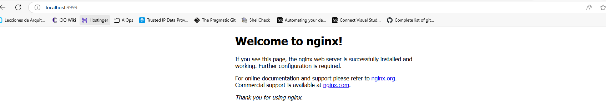

Se deben ejecutar unas tareas previas:
- clonar un repositorio que contiene la página web que se debe mostrar,
- copiar el contenido de este repositorio, desde el *host* hacia el contenedor en una ruta específica,
- validar que la copia se ejecutó correctamente,

```console
❯ git clone -b devops-simple-web https://github.com/roxsross/devops-static-web.git
Cloning into 'devops-static-web'...
remote: Enumerating objects: 789, done.
remote: Counting objects: 100% (11/11), done.
remote: Compressing objects: 100% (7/7), done.
remote: Total 789 (delta 6), reused 4 (delta 4), pack-reused 778 (from 1)
Receiving objects: 100% (789/789), 85.79 MiB | 10.50 MiB/s, done.
Resolving deltas: 100% (127/127), done.
 
❯ docker cp .\devops-static-web\bootcamp-web\. bootcamp-web:/usr/share/nginx/html/
Successfully copied 5.12kB to bootcamp-web:/usr/share/nginx/html/
 
❯ docker exec -it bootcamp-web bash
root@244a8b0d2414:/# pwd
/
root@244a8b0d2414:/# ls -la /usr/share/nginx/html/
total 24
drwxr-xr-x 1 root root 4096 Jul  1 16:49 .
drwxr-xr-x 1 root root 4096 Jul  1 02:12 ..
-rw-r--r-- 1 root root  497 Jun 24 17:22 50x.html
-rwxr-xr-x 1 root root 1722 Jul  1 16:48 index.html
-rwxr-xr-x 1 root root  146 Jul  1 16:48 styles.css
root@244a8b0d2414:/#
```
Ahora, se muestra la evidencia del sitio web personalizado:

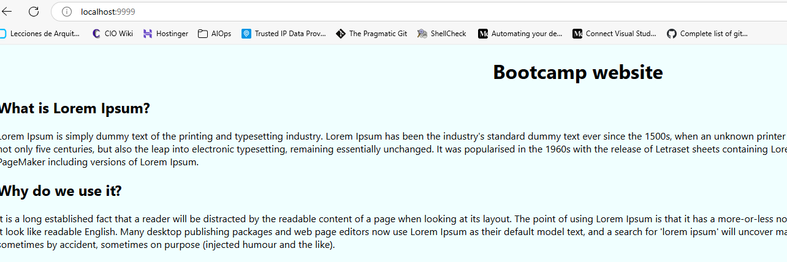

Un concepto crucial al trabajar con Docker son las variables de entorno, las cuales pueden ser enviadas desde el *host* hasta un contenedor, así:
```console
╰─○ docker run -d --name some-mariadb -e MARIADB_ROOT_PASSWORD=my-secret-pw mariadb
Unable to find image 'mariadb:latest' locally
latest: Pulling from library/mariadb
48f38a8fddb6: Pull complete
271c152ca4f4: Pull complete
87381ff545f9: Pull complete
724d2bd0d22b: Pull complete
1505691d6c89: Pull complete
54629b454f33: Pull complete
25a7db65036f: Pull complete
Digest: sha256:1e669024fc94f626b9dc48bf47b29b5339cec203c28e61a3dc372991a345daf5
Status: Downloaded newer image for mariadb:latest
9080d757df794bdf2884fa0fbbcaa726b14231ed34f358e42a690b12bd10e17e

╰─○ docker ps -a
CONTAINER ID   IMAGE     COMMAND                  CREATED              STATUS              PORTS      NAMES
9080d757df79   mariadb   "docker-entrypoint.s…"   About a minute ago   Up About a minute   3306/tcp   some-mariadb

╰─○ docker exec -it some-mariadb sh 
# pwd
/
# env
HOSTNAME=9080d757df79
HOME=/root
TERM=xterm
PATH=/usr/local/sbin:/usr/local/bin:/usr/sbin:/usr/bin:/sbin:/bin
MARIADB_ROOT_PASSWORD=my-secret-pw
LANG=C.UTF-8
GOSU_VERSION=1.17
MARIADB_VERSION=1:11.8.2+maria~ubu2404
PWD=/
# mariadb -u root -p
Enter password: 
Welcome to the MariaDB monitor.  Commands end with ; or \g.
Your MariaDB connection id is 3
Server version: 11.8.2-MariaDB-ubu2404 mariadb.org binary distribution

Copyright (c) 2000, 2018, Oracle, MariaDB Corporation Ab and others.

Type 'help;' or '\h' for help. Type '\c' to clear the current input statement.

MariaDB [(none)]>
```
<span style="color:blue;font-weight:700;font-size:16px">
    <h2>
        Día 10 - Reto del Día
    </h2>
</span>

🎯 *Objetivo:*

Crear un contenedor, preferiblemente usando un *shell script*, que ejecute las siguientes acciones:
- Obtener la fecha / hora del contenedor,
- Escribir la fecha / hora del contenedor en un archivo del contenedor,
- Copiar el archivo resultante, desde el contenedor hacia el *host*,
- Obtener la dirección IP del contenedor,
- Ejecutar el comando `docker top` y validar que el proceso principal sigue en ejecución,
- Forzar el borrado del contenedor.

Este es el script usado:

```shell
#! /bin/bash

docker run -d --name retodeldia alpine:latest sh -c "date > /home/date.txt && sleep 60"
docker cp retodeldia:/home/date.txt ./date.txt
docker inspect retodeldia | grep IPAddress
docker top retodeldia
docker rm -f retodeldia
```
Esta es la evidencia:

```console
╰─○ bash dia10-retoDelDia.sh
35f488690013d5aba1ae42ea194d875343f016c703932af0d2ba59a7a5570cdc
Successfully copied 2.05kB to /mnt/c/Users/auprotec/Vagrant/Week 2/date.txt
            "SecondaryIPAddresses": null,
            "IPAddress": "172.17.0.2",
                    "IPAddress": "172.17.0.2",
UID                 PID                 PPID                C                   STIME               TTY                 TIME                CMD
root                2927                2904                4                   19:22               ?                   00:00:00            sleep 60
```
Como *bonus* al Reto del Día, se propone ejecutar un contenedor con base en la imagen **MariaDB**, pasando al contenedor las variables de usuario, contraseña, y nombre de una base de datos.

A continuación, las evidencias.

- Contenedor creado
```console
docker ps -a
CONTAINER ID   IMAGE            COMMAND                  CREATED             STATUS             PORTS                    NAMES
b586c634f6c0   mariadb:latest   "docker-entrypoint.s…"   3 minutes ago       Up 3 minutes       0.0.0.0:3306->3306/tcp   mydb 
```
- Acceso al contenedor:
```console
❯ docker exec -it mydb sh
# mariadb -u root -p
Enter password: 
Welcome to the MariaDB monitor.  Commands end with ; or \g.
Your MariaDB connection id is 10
Server version: 11.8.2-MariaDB-ubu2404 mariadb.org binary distribution

Copyright (c) 2000, 2018, Oracle, MariaDB Corporation Ab and others.

Type 'help;' or '\h' for help. Type '\c' to clear the current input statement.

MariaDB [(none)]> quit
Bye
# env 
HOSTNAME=b586c634f6c0
HOME=/root
MARIADB_DATABASE=mibasededatos
TERM=xterm
PATH=/usr/local/sbin:/usr/local/bin:/usr/sbin:/usr/bin:/sbin:/bin
MARIADB_ROOT_PASSWORD=RootPassword
LANG=C.UTF-8
MARIADB_PASSWORD=Password123
GOSU_VERSION=1.17
MARIADB_VERSION=1:11.8.2+maria~ubu2404
PWD=/
MARIADB_USER=usuario
#
```
- El comando utilizado:
```shell
docker run --rm --name mydb -e MARIADB_ROOT_PASSWORD=RootPassword -e MARIADB_DATABASE=mibasededatos -e MARIADB_USER=usuario -e MARIADB_PASSWORD=Password123 -p 3306:3306 mariadb:latest
```
🧠 **¿Qué aprendí?**
- *Shell scripting* es una herramienta muy versátil. Tanto en el contexto de Ansible, como en el de Docker, un script de shell puede manejar todo el proceso con relativa facilidad.
- La importancia de las variables para la interacción entre el *host* y un contenedor.

<span style="color:blue;font-weight:700;font-size:16px">
    <h2>
        Día 11 - Redes y Volúmenes en Docker
    </h2>
</span>

<span style="color:green;font-weight:400;font-size:14px">
    <h3>
        Red tipo Bridge - por defecto
    </h3>
</span>

- Dos contenedores creados se pueden comunicar entre ellos, usando sus nombres DNS, si están en la misma red de tipo *bridge*.
- El rango de direcciones por defecto es 172.17.0.0/16.
```console
╰─○ docker ps -a
CONTAINER ID   IMAGE            COMMAND                  CREATED          STATUS                      PORTS                    NAMES
b586c634f6c0   mariadb:latest   "docker-entrypoint.s…"   34 minutes ago   Up 34 minutes               0.0.0.0:3306->3306/tcp   mydb
9080d757df79   mariadb          "docker-entrypoint.s…"   2 hours ago      Up 2 hours                  3306/tcp                 some-mariadb
╰─○ docker inspect mydb| grep IPAddress
            "SecondaryIPAddresses": null,
            "IPAddress": "172.17.0.2",
                    "IPAddress": "172.17.0.2",
╰─○ docker inspect some-mariadb| grep IPAddress
            "SecondaryIPAddresses": null,
            "IPAddress": "172.17.0.4",
                    "IPAddress": "172.17.0.4",
```
- Se pueden crear redes *bridge* adicionales, con un espacio de direcciones IP diferente:

```console
❯ docker network create --driver bridge --subnet 192.168.200.0/24 mi-red-bridge
ce60cb06fc085b078e077f9bd820fd60828e66c9a4a48d958640b490f8c6e8ee

❯ docker network ls
NETWORK ID     NAME            DRIVER    SCOPE
7bd64672a9e0   bridge          bridge    local
458286c3554f   host            host      local
ce60cb06fc08   mi-red-bridge   bridge    local
0588be262448   none            null      local

❯ docker network inspect mi-red-bridge
[
    {
        "Name": "mi-red-bridge",
        "Id": "ce60cb06fc085b078e077f9bd820fd60828e66c9a4a48d958640b490f8c6e8ee",
        "Created": "2025-07-01T21:09:17.43129727Z",
        "Scope": "local",
        "Driver": "bridge",
        "EnableIPv4": true,
        "EnableIPv6": false,
        "IPAM": {
            "Driver": "default",
            "Options": {},
            "Config": [
                {
                    "Subnet": "192.168.200.0/24"
                }
            ]
        },
        "Internal": false,
        "Attachable": false,
        "Ingress": false,
        "ConfigFrom": {
            "Network": ""
        },
        "ConfigOnly": false,
        "Containers": {},
        "Options": {},
        "Labels": {}
    }
]
```

<span style="color:green;font-weight:400;font-size:14px">
    <h3>
        Red tipo Host
    </h3>
</span>

- El contenedor comparte directamente la red del *host*.
- El contenedor utiliza los puertos y las interfaces del *host*.

<span style="color:green;font-weight:400;font-size:14px">
    <h3>
        Red tipo None
    </h3>
</span>

- El contenedor no está conectado a ninguna red.
- El contenedor está completamente aislado.
- Se usa en casos de seguridad máxima, o cuando solamente se desea compartir almacenamiento con el *host*.

<span style="color:green;font-weight:400;font-size:14px">
    <h3>
        Red tipo macvlan
    </h3>
</span>

- Asigna una dirección IP directamente desde la red física (LAN) al contenedor.
- El contenedor aparece como un dispositivo más en la red, con su propia IP.

<span style="color:green;font-weight:400;font-size:14px">
    <h3>
        Volúmenes en Docker
    </h3>
</span>

- Son la forma recomendada y persistente de almacenar datos generados o utilizados por contenedores.
- A diferencia de los datos almacenados dentro del sistema de archivos del contenedor, **los volúmenes persisten incluso si el contenedor se elimina, reinicia o actualiza.**

<span style="color:green;font-weight:400;font-size:13px">
    <h4>
        Tipos de Volúmenes
    </h4>
</span>

| Tipo             | Descripción                                                                                                  | Persistencia |
| ---------------- | ------------------------------------------------------------------------------------------------------------ | ------------ |
| **Volumes**      | Administrados por Docker. Viven en `/var/lib/docker/volumes` en el host. También se pueden usar *drivers* externos (NFS, EFS, Azure File, etc.). `-v nombre-volumen:/path/en-contenedor`| Alta         |
| **Bind mounts**  | Montan un archivo o carpeta específica del sistema operativo del host dentro del contenedor. `-v /path/en-host:/path/en-contenedor`                                                            | Alta         |
| **Tmpfs mounts** | Volúmenes efímeros en memoria RAM. No se escriben en disco.                                                  | Solo en RAM  |


<span style="color:green;font-weight:400;font-size:13px">
    <h4>
        🚀¿Cómo se usan los volúmenes gestionados por Docker en entornos productivos?
    </h4>
</span>

**🔥Persistencia de datos críticos**
- Ejemplo
_Un contenedor que alojará un servidor de base de datos PostgreSQL para una aplicación web de comercio electrónico necesita **almacenar y persistir datos transaccionales como órdenes, usuarios y pagos**. Para evitar la pérdida de datos si el contenedor falla, se utiliza un volumen Docker donde se guardan todos los datos de la base de datos._
- Comando *docker* respectivo:
```console
docker run -d \
  --name postgres-db \
  -e POSTGRES_PASSWORD=claveSegura \
  -v postgres-data:/var/lib/postgresql/data \
  postgres:16
```
- Aunque se elimine el contenedor, los datos almacenados en `postgres-data` se conservan.

**🔥Separación de datos y aplicación**
- Ejemplo
_En un contenedor que ejecuta NGINX como servidor web para un sitio corporativo, **los logs de acceso y error no deben quedarse dentro del contenedor. Estos logs son útiles para sistemas externos de monitoreo, auditoría o cumplimiento.** Por eso, se montan como volúmenes separados que permiten acceder a ellos desde el host o recolectores de logs como Filebeat o Fluentd._
- Comando *docker* respectivo:
```console
docker run -d \
  --name webserver \
  -v /srv/nginx-logs:/var/log/nginx \
  -p 80:80 \
  nginx
```
- Los logs están disponibles en `/srv/nginx-logs`.

**🔥Backups y restauración en caliente**
- Ejemplo
_Una empresa que gestiona un contenedor con MariaDB para su sistema de facturación necesita realizar **backups periódicos de la base de datos**. Los datos se almacenan en un volumen persistente y se respaldan periódicamente utilizando otro contenedor que empaqueta el contenido del volumen y lo **sube a un almacenamiento externo como AWS S3**._
- Comando *docker* respectivo:
```console
docker run --rm \
  -v mariadb-data:/data \
  -v $(pwd):/backup \
  alpine \
  tar czf /backup/mariadb-backup.tar.gz -C /data .
```
- El archivo `mariadb-backup.tar.gz` almacena todo el contenido del volumen `mariadb-data`, listo para almacenarse externamente.

**🔥Compartir datos entre contenedores**
- Ejemplo
_En un pipeline de procesamiento de imágenes, **un contenedor que recibe imágenes de usuarios desde una aplicación móvil guarda temporalmente los archivos en un volumen Docker. Otro contenedor,** ejecutando un servicio de análisis (por ejemplo, detección de objetos o compresión), **accede al mismo volumen para procesar esas imágenes** sin necesidad de transferirlas por red._
- Comando *docker* respectivo:
```console
docker volume create imagenes-temporales

docker run -d --name uploader \
  -v imagenes-temporales:/app/uploads \
  uploader-image

docker run --rm --name processor \
  -v imagenes-temporales:/data \
  processor-image
```
- El contenedor `processor` puede leer las imágenes subidas por `uploader` directamente desde el volumen compartido.
- Este volumen, gestionado por Docker, es persistente y está localizado internamente en el host en `/var/lib/docker/volumes/imagenes-temporales/_data`.


**🔥Montajes de configuración segura**
- Ejemplo
_Una empresa que ejecuta un contenedor de NGINX como reverse proxy para servicios críticos necesita mantener los certificados TLS (SSL) actualizados. En lugar de incluir estos certificados dentro de la imagen Docker, se montan como volúmenes desde una ubicación segura del host, lo que permite actualizar los certificados sin detener ni reconstruir el contenedor._
- Comando *docker* respectivo:
```console
docker run -d \
  --name nginx-reverse-proxy \
  -v /srv/certs:/etc/nginx/certs:ro \
  -v /srv/nginx/conf:/etc/nginx/conf.d:ro \
  -p 443:443 \
  nginx
```
- Los certificados pueden renovarse directamente en `/srv/certs` sin reiniciar el contenedor.

<span style="color:green;font-weight:400;font-size:14px">
    <h3>
        Reto del Día - Conectar y Persistir
    </h3>
</span>

🎯 *Objetivo:*

Crear un contenedor que ejecute las siguientes acciones:
- Crear una red personalizada, tipo *bridge*, llamada *miapp-net*.
- Ejecutar 2 contenedores, *api* y *db*, en esa red.
- Verificar conectividad entre los 2 contenedores.
- Crear un volumen *vol-db* y montarlo en la ruta `/datos` del contenedor *db*.
- Desde el contenedor *db*, escribir un archivo en `/datos/info.txt`.
- Eliminar el contenedor.
- Crearlo de nuevo y validar si el archivo aún existe.

A continuación, las evidencias.

- Shell script utilizado:
```shell
#! /bin/bash

docker network create --driver bridge --subnet 172.18.0.0/16 miapp-net
docker run -d --name api --network miapp-net alpine:latest sh -c "apk add --no-cache iputils && while true; do sleep 1; done"
docker run -d --name db --network miapp-net -v vol-db:/datos alpine:latest sh -c "apk add --no-cache iputils && while true; do sleep 1; done"
docker exec api ping -c 4 db
docker exec db sh -c "echo 'Datos de la base de datos' > /datos/info.txt"
docker rm -f db
docker run -d --name db --network miapp-net -v vol-db:/datos alpine:latest sh -c "while true; do sleep 1; done"
docker exec db ls /datos/info.txt && echo "El archivo info.txt existe en el volumen vol-db."
docker rm -f db
docker rm -f api
docker network rm miapp-net
```
- Ejecución del script:
```console
❯ bash dia11-retoDelDia.sh        
98130d1f10c90c36ddf96a18751f6d6449cd94dace43445f7624d58483528b0e
20a7b7d02b9fe8f65eb717997af5ac11ac518ba5bd1d0a268736f48f3b41d822
169d343af4296331f1042cb8942ca30d4af339a311b636583e81c6e60c1e5993
PING db (172.18.0.3): 56 data bytes
64 bytes from 172.18.0.3: seq=0 ttl=64 time=0.528 ms
64 bytes from 172.18.0.3: seq=1 ttl=64 time=0.039 ms
64 bytes from 172.18.0.3: seq=2 ttl=64 time=0.123 ms
64 bytes from 172.18.0.3: seq=3 ttl=64 time=0.193 ms

--- db ping statistics ---
4 packets transmitted, 4 packets received, 0% packet loss
round-trip min/avg/max = 0.039/0.220/0.528 ms
db
59515b277d37fb742293f87c923e78c31f7f2de87509b3104a7901d8d190abff
/datos/info.txt
El archivo info.txt existe en el volumen vol-db.
db
api
miapp-net
```
- Red creada:
```console
❯ docker network inspect miapp-net
[
    {
        "Name": "miapp-net",
        "Id": "3cb6c5c171c461c52783d69be83e9ca5e28cf5b61f348f1ab9a0cf49e8ebbcd4",
        "Created": "2025-07-02T13:02:32.116852484Z",
        "Scope": "local",
        "Driver": "bridge",
        "EnableIPv4": true,
        "EnableIPv6": false,
        "IPAM": {
            "Driver": "default",
            "Options": {},
            "Config": [
                {
                    "Subnet": "172.18.0.0/16"
                }
            ]
        },
        "Internal": false,
        "Attachable": false,
        "Ingress": false,
        "ConfigFrom": {
            "Network": ""
        },
        "ConfigOnly": false,
        "Containers": {
            "16f600391642ce0d463fea0c2abc63bf8c58fd65d42bd310fdaeb97c053a2e29": {
                "Name": "api",
                "EndpointID": "ef07c41ede8e94dff06799dac566b95b3329abb9a9873d4c98cb6296d4bd5ccc",
                "MacAddress": "5a:76:e5:00:6d:bc",
                "IPv4Address": "172.18.0.2/16",
                "IPv6Address": ""
            },
            "287aa3713eff0c32326a805c3cc09a3e7aa18664cb1151701de90bc3192adc41": {
                "Name": "db",
                "EndpointID": "fc8d16fa0d29809266db074fc04a1cea53c22bf70bdab2578557286059e97d8f",
                "MacAddress": "0a:e6:a1:4d:18:57",
                "IPv4Address": "172.18.0.3/16",
                "IPv6Address": ""
            }
        },
        "Options": {},
        "Labels": {}
    }
]
```
- Volumen creado:
```console
❯ docker volume list
DRIVER    VOLUME NAME
local     4e5f6fd1f55e1245312c0bcb57ed74023a7df944fafe148cc091435b0280ad7c
local     47d70ba0a820b3147468c81f3399711f2a2d448aaf019a6ed534bd781acc4f93
local     vol-db
 
❯ docker volume inspect vol-db
[
    {
        "CreatedAt": "2025-07-02T12:53:55Z",
        "Driver": "local",
        "Labels": null,
        "Mountpoint": "/var/lib/docker/volumes/vol-db/_data",
        "Name": "vol-db",
        "Options": null,
        "Scope": "local"
    }
]

❯ docker exec -it db sh       
/ # ls
bin    datos  dev    etc    home   lib    media  mnt    opt    proc   root   run    sbin   srv    sys    tmp    usr    var
/ # ls datos/
info.txt
/ # cat datos/info.txt
Datos de la base de datos
/ #
```
<span style="color:blue;font-weight:700;font-size:16px">
    <h2>
        Día 12 - Trabajando con imágenes Docker
    </h2>
</span>

🧠 **¿Qué aprendí?**
- El orden de los parámetros que se pasan a `docker run` es importante:
  - Todo lo que va antes del nombre de la imagen (mysql, nginx, etc.) son opciones para el comando `docker run`.
  - Todo lo que va después del nombre de la imagen se interpreta como el comando que debe ejecutar dentro del contenedor (sobrescribe el CMD del Dockerfile si lo hay).
- Entonces, no es lo mismo ejecutar:
```console
docker run -d --name my_mysql mysql -p 3306:3306 -e MYSQL_ROOT_PASSWORD=password
```
que ejecutar:
```console
docker run -d --name my_mysql -p 3306:3306 -e MYSQL_ROOT_PASSWORD=password mysql
```

<span style="color:green;font-weight:400;font-size:14px">
    <h3>
        Reto del Día - Variables de entorno desde Dockerfile
    </h3>
</span>

- Evidencias:

```shell
FROM alpine
ENV SALUDO="¡Hola Andres DevOps!"
CMD ["sh", "-c", "echo $SALUDO && sleep 5"]
```

- Contenedor en ejecución:
```console
╰─○ ls
Dockerfile
╰─○ docker build -t andres-devops .
[+] Building 3.8s (5/5) FINISHED                                                                                                                                                docker:default
 => [internal] load build definition from Dockerfile                                                                                                                                      0.1s
 => => transferring dockerfile: 129B                                                                                                                                                      0.0s 
 => [internal] load metadata for docker.io/library/alpine:latest                                                                                                                          3.4s
 => [internal] load .dockerignore                                                                                                                                                         0.0s
 => => transferring context: 2B                                                                                                                                                           0.0s 
 => [1/1] FROM docker.io/library/alpine:latest@sha256:8a1f59ffb675680d47db6337b49d22281a139e9d709335b492be023728e11715                                                                    0.0s 
 => => resolve docker.io/library/alpine:latest@sha256:8a1f59ffb675680d47db6337b49d22281a139e9d709335b492be023728e11715                                                                    0.0s 
 => exporting to image                                                                                                                                                                    0.1s 
 => => exporting layers                                                                                                                                                                   0.0s 
 => => exporting manifest sha256:5986d40a9fb6151f95859d6d26ba61e605377fa6ac43c402ad1d3bbe8bf51b43                                                                                         0.0s 
 => => exporting config sha256:c4a56344b356807ab0ef2745e050263802e6ed9df36573ff2e2b68b2b2f22e18                                                                                           0.0s 
 => => exporting attestation manifest sha256:8185f4bff3abd34cf548a3edd0a9d114203076efd08e072d34ca5624b534bf27                                                                             0.0s 
 => => exporting manifest list sha256:a29c7666eeabcfdec51aaeca84a94c97ac72a3877574502e6c460537f718eead                                                                                    0.0s
 => => naming to docker.io/library/andres-devops:latest                                                                                                                                   0.0s 
 => => unpacking to docker.io/library/andres-devops:latest                                                                                                                                0.0s 

╰─○ docker run --rm andres-devops
¡Hola Andres DevOps!
```
<span style="color:blue;font-weight:700;font-size:16px">
    <h2>
        Día 13 - Docker Compose
    </h2>
</span>

🧠 **¿Qué aprendí?**
- En la estructura de un archivo de tipo *docker-compose.yml*, existen detalles importantes.
- En el ejemplo a continuación se definen 2 contenedores: *frontend* y *db*.
- El contenedor *frontend* se genera a partir de una imagen personalizada. El otro contenedor se genera a partir de una imagen estándar.
- Para el primero, se usa la palabra clave `build` y utilizar un Dockerfile respectivo. 
- Para el segundo, basta con la palabra clave `image`.
```yaml
services:
  frontend:
    build: 
      context: ./frontend
      dockerfile: Dockerfile
    ports:
      - "3000:3000"
    environment:
    ...

  db:
    image: mongo:7-jammy
    ports:
      - "27017:27017"
    environment:
      - MONGO_INITDB_ROOT_USERNAME=admin
      - MONGO_INITDB_ROOT_PASSWORD=password123
    ...
```
- Para cada contenedor, se hace referencia de la red que va a usar y de los volúmenes asociados. Posteriormente, al final del archivo, se definen estos 2 elementos en detalle.
```yaml
services:
  frontend:
    build: 
      context: ./frontend
      dockerfile: Dockerfile
    ...
    networks:
      - app-network
    restart: unless-stopped

  db:
    image: mongo:7-jammy
    ports:
      - "27017:27017"
    ...
    volumes:
      - mongo_data:/data/db
    networks:
      - app-network
    
networks:
  app-network:
    driver: bridge
    name: mi-app-network

volumes:
  mongo_data:
    driver: local
    name: mi-app-mongo-data
```
<span style="color:green;font-weight:400;font-size:14px">
    <h3>
        Wordpress en Docker compose
    </h3>
</span>

- Logré modificar el script propuesto por Rossana, para hacer que las contraseñas utilizadas por los contenedores estén afuera del mismo, así:
  - Agregué 2 archivos dentro de un nuevo directorio llamado *secrets*:
```console
tree -D     
[Jul  2 15:26]  .
├── [Jul  2 15:57]  docker-compose.yml
├── [Jul  2 15:50]  secrets
│   ├── [Jul  2 15:40]  db_password.txt
│   └── [Jul  2 15:50]  wp_password.txt
```
  - Instancié estos 2 archivos de manera independiente para cada contenedor en el archivo `docker-compose.yml`:
```yml
services:
  wordpress:
    image: wordpress:php8.2-apache
    container_name: wp-web
    restart: unless-stopped
    ports:
      - "8090:80"
    secrets:
      - wp_password
    environment:
      WORDPRESS_DB_HOST: db
      WORDPRESS_DB_USER: wpuser
      WORDPRESS_DB_PASSWORD_FILE: /run/secrets/wp_password
      WORDPRESS_DB_NAME: wpdb
...

  db:
    image: mariadb:11.3
    container_name: wp-db
    restart: unless-stopped
    secrets:
      - db_password
      - wp_password
    environment:
      MYSQL_ROOT_PASSWORD_FILE: /run/secrets/db_password
      MYSQL_DATABASE: wpdb
      MYSQL_USER: wpuser
      MYSQL_PASSWORD_FILE: /run/secrets/wp_password
    ...
    healthcheck:
      test: ["CMD-SHELL", "mariadb-admin ping -h localhost -uroot -p$(cat /run/secrets/db_password)"]
      interval: 5s
    ...

  phpmyadmin:
    image: phpmyadmin:latest
    container_name: wp-admin
    restart: unless-stopped
    ports:
      - "8095:80"
    secrets:
      - wp_password
    environment:
      PMA_HOST: db
      PMA_USER: wpuser
      PMA_PASSWORD_FILE: /run/secrets/wp_password
    ...
volumes:
  wp_data:
  db_data:

networks:
  wp_network:
    driver: bridge
secrets:
  db_password:
    file: ./secrets/db_password.txt
  wp_password:
    file: ./secrets/wp_password.txt
```
- Evidencias de la ejecución de `docker compose up -d`:
```console
❯ docker compose up -d  
[+] Running 39/40
 ✔ db Pulled               212.4s 
 ✔ wordpress Pulled               220.9s 
 ✔ phpmyadmin Pulled               219.9s 

[+] Running 6/6
 ✔ Network compose-1_wp_network  Created                 0.2s 
 ✔ Volume "compose-1_db_data"    Created                 0.0s 
 ✔ Volume "compose-1_wp_data"    Created                 0.0s 
 ✔ Container wp-db               Created                27.6s 
 ✔ Container wp-web              Created                 0.4s 
 ✔ Container wp-admin            Started                 1.5s  
```
- Evidencias de accesos a servicios via web:

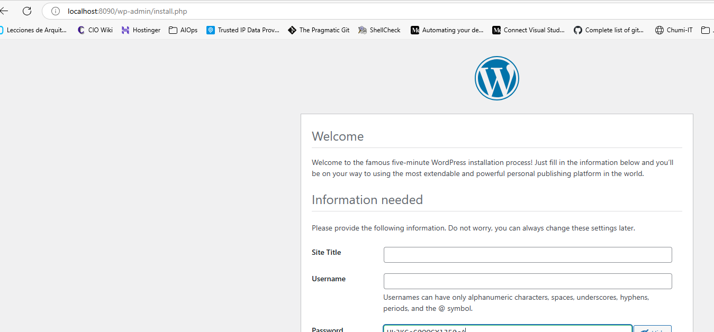

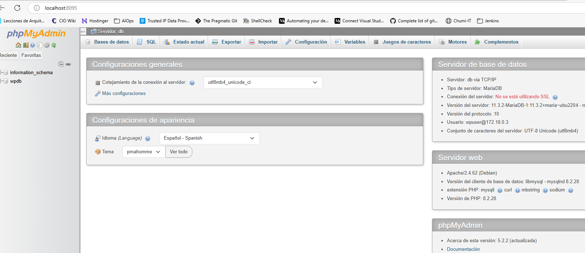

<span style="color:green;font-weight:400;font-size:14px">
    <h3>
        Tarea Práctica: Aplicación Node.js + MongoDB con Docker Compose
    </h3>
</span>

🎯 *Objetivo:*
Implementar una aplicación Node.js con MongoDB usando Docker Compose, asegurando persistencia de datos y conexión entre servicios.

- Evidencia de la creación de los contenedores:
```console
docker compose up -d
Compose can now delegate builds to bake for better performance.
 To do so, set COMPOSE_BAKE=true.
[+] Building 14.2s (11/11) FINISHED                                                                                                         docker:default
 => [backend internal] load build definition from Dockerfile                                                                                          0.0s
 => => transferring dockerfile: 145B                                                                                                                  0.0s
 => [backend internal] load metadata for docker.io/library/node:18-alpine                                                                             1.4s
 => [backend internal] load .dockerignore                                                                                                             0.0s
 => => transferring context: 2B                                                                                                                       0.0s
 => [backend 1/5] FROM docker.io/library/node:18-alpine@sha256:8d6421d663b4c28fd3ebc498332f249011d118945588d0a35cb9bc4b8ca09d9e                       0.0s
 => => resolve docker.io/library/node:18-alpine@sha256:8d6421d663b4c28fd3ebc498332f249011d118945588d0a35cb9bc4b8ca09d9e                               0.0s
 => [backend internal] load build context                                                                                                             0.0s
 => => transferring context: 308B                                                                                                                     0.0s
 => CACHED [backend 2/5] WORKDIR /app                                                                                                                 0.0s
 => [backend 3/5] COPY package.json .                                                                                                                 0.0s
 => [backend 4/5] RUN npm install                                                                                                                    10.6s
 => [backend 5/5] COPY . .                                                                                                                            0.0s
 => [backend] exporting to image                                                                                                                      1.9s
 => => exporting layers                                                                                                                               1.1s
 => => exporting manifest sha256:f4e36832ee1d50c292ad28ca11f33026963dac4590481d85f28d9108931562ab                                                     0.0s
 => => exporting config sha256:f8cac0459b04996c53a00c0060d050f85cd5d32208c47bcd3bf25c4e5c77aa31                                                       0.0s
 => => exporting attestation manifest sha256:b5340df8f3e3d6d05f683c64097ff9758426f165fde49d70b8b23c526c02a1fa                                         0.0s
 => => exporting manifest list sha256:bb760ad26e78f075153d39b7a33ce1e84612a6019a45b4a777bdec7ab179c8c0                                                0.0s 
 => => naming to docker.io/library/node-mongo-app-backend:latest                                                                                      0.0s 
 => => unpacking to docker.io/library/node-mongo-app-backend:latest                                                                                   0.7s 
 => [backend] resolving provenance for metadata file                                                                                                  0.0s
[+] Running 5/5
 ✔ backend                             Built                                                                                                          0.0s 
 ✔ Network node-mongo-app_default      Created                                                                                                        0.1s 
 ✔ Volume "node-mongo-app_db_data"     Created                                                                                                        0.0s 
 ✔ Container node-mongo-app-db-1       Healthy                                                                                                        6.7s 
 ✔ Container node-mongo-app-backend-1  Started                                                                                                        6.7s 

╰─○ docker compose ps -a
NAME                       IMAGE                    COMMAND                  SERVICE   CREATED          STATUS                    PORTS
node-mongo-app-backend-1   node-mongo-app-backend   "docker-entrypoint.s…"   backend   46 seconds ago   Up 38 seconds             0.0.0.0:3010->3000/tcp
node-mongo-app-db-1        mongo:6                  "docker-entrypoint.s…"   db        46 seconds ago   Up 45 seconds (healthy)   27017/tcp

╰─○ docker compose exec db mongosh --eval "show dbs"
admin   40.00 KiB
config  12.00 KiB
local   40.00 KiB
```
- Evidencia de la conexión entre los contenedores:

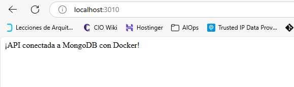

- Agregar una nueva base de datos y validando que está creada correctamente:
```console
╰─○ docker compose exec db mongosh --eval "db.test.insertOne({name: 'Ejemplo'})"

{
  acknowledged: true,
  insertedId: ObjectId('6865adc570beef68d5baa8b9')
}

╰─○ docker compose exec db mongosh --eval "show dbs"

admin    40.00 KiB
config  128.00 KiB
local    72.00 KiB
test      8.00 KiB
```
- Ahora, reinicio los contenedores y vuelvo a validar que los datos han persistido:
```console
╰─○ docker compose down && docker compose up -d
[+] Running 3/3
 ✔ Container node-mongo-app-backend-1  Removed                                                                                                       10.6s 
 ✔ Container node-mongo-app-db-1       Removed                                                                                                        0.5s 
 ✔ Network node-mongo-app_default      Removed                                                                                                        0.7s 
[+] Running 3/3
 ✔ Network node-mongo-app_default      Created                                                                                                        0.0s 
 ✔ Container node-mongo-app-db-1       Healthy                                                                                                        6.7s 
 ✔ Container node-mongo-app-backend-1  Started                                                                                                        6.8s 

╰─○ docker compose exec db mongosh --eval "show dbs"

admin    40.00 KiB
config  128.00 KiB
local    72.00 KiB
test     40.00 KiB

```
<span style="color:green;font-weight:400;font-size:14px">
    <h3>
        Tarea Práctica: Bonus Avanzado, añadir un frontend React
    </h3>
</span>

Actualmente, la estructura del proyecto está así:
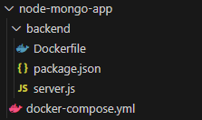

Al añadir el frontend, la estructura del proyecto queda así:
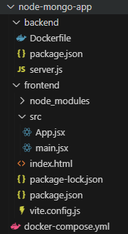

Agregué el frontend para que atienda por el puerto 5173, lo cual se evidencia en la siguiente captura:

```console
─○ docker compose ps -a
NAME                        IMAGE                    COMMAND                  SERVICE    CREATED          STATUS                    PORTS
node-mongo-app-backend-1    node-mongo-app-backend   "docker-entrypoint.s…"   backend    41 seconds ago   Up 34 seconds             0.0.0.0:3010->3000/tcp
node-mongo-app-db-1         mongo:6                  "docker-entrypoint.s…"   db         41 seconds ago   Up 41 seconds (healthy)   27017/tcp
node-mongo-app-frontend-1   node:18-alpine           "docker-entrypoint.s…"   frontend   41 seconds ago   Up 34 seconds             0.0.0.0:5173->5173/tcp
```
Y la evidencia en el navegador:
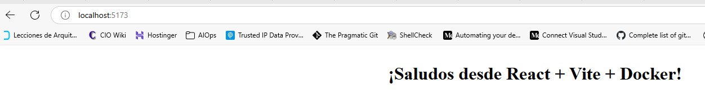

<span style="color:green;font-weight:400;font-size:14px">
    <h3>
        Desafío Final Semana 2
    </h3>
</span>

🎯 *Objetivo:*
Desplegar la aplicación web de Votos, pero esta vez con contenedores. Las características que debe tener este despliegue son:
- Archivo *docker compose* para desplegar, al menos, 5 contenedores:
  - Uno para la funcionalidad Vote, en Flask. Debe estar basado en una imagen personalizada.
  - Uno para el nodo Worker, con Node.js. Debe estar basado en una imagen personalizada.
  - Uno para el nodo Results, con Node.js. Debe estar basado en una imagen personalizada.
  - Uno para Redis. Puede usar una imagen estándar.
  - Uno para PostgreSQL. Puede usar una imagen estándar.
- Validar que los puertos no están en uso en la máquina anfitrión antes de ejecutar los contenedores.
- Usar un archivo de variables.
- Agregar un volumen para persistir los datos de PostreSQL.
- Usar "build context".
- Usar una red personalizada.
- Usar adecuadamente la funcionalidad "depends_on".
- Agregar chequeos de salud de los servicios principales.

🧠 **¿Qué aprendí?**
- A "portar" un proyecto desde una tecnología (Vagrant + Ansible) a otra tecnología (Docker con Docker compose).
- A desacoplar un monolito en contenedores discretos, independientes, todos estos dentro de un entorno de red personalizada.
- Obviamente, es mucho más claro y "limpio" el despliegue de una aplicación en contenedores, en comparación con un entorno en máquina virtual. Sin embargo, por experiencia profesional, un monolito no es una mala opción por definición, especialmente en entornos corporativos en donde existen muchas variables adicionales a considerar, además de la técnica.
- La importancia del uso de archivos de variables, pues esto se puede extrapolar para despliegues en entornos productivos con facilidad. 
- La persistencia de los shell scripts en todo el bootcamp, dado que éstos permiten simplificar y organizar adecuadamente todas las tareas involucradas.

**Arquitectura de despliegue**
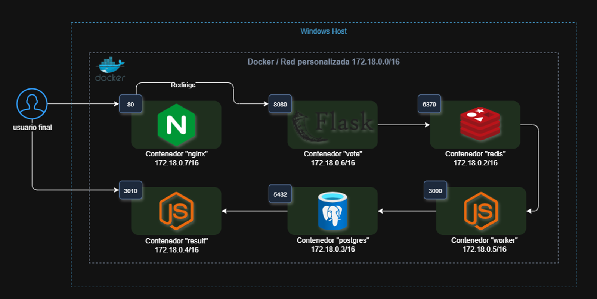

**Evidencias**

- Despliegue exitoso del proyecto (versión editada del output):

```console
╰─○ ./launch.sh         
🔎 Verificando disponibilidad de puertos...
✅ Puerto 80 está libre
✅ Puerto 8080 está libre
✅ Puerto 3000 está libre
✅ Puerto 3010 está libre
✅ Puerto 5432 está libre

🚀 Todos los puertos están disponibles. Iniciando stack en modo detached...
Compose can now delegate builds to bake for better performance.
 To do so, set COMPOSE_BAKE=true.
[+] Building 24.2s (39/39) FINISHED                                                                                                                      docker:default
 => [vote internal] load build definition from Dockerfile                                                                                                          0.1s
 => => transferring dockerfile: 910B                                                                                                                               0.0s 
 => [result internal] load build definition from Dockerfile                                                                                                        0.1s 
 => => transferring dockerfile: 616B                                                                                                                               0.0s 
 => [worker internal] load build definition from Dockerfile                                                                                                        0.1s 
 => => transferring dockerfile: 255B                                                                                                                               0.0s 
 => [vote internal] load metadata for docker.io/library/python:3.11-slim                                                                                           1.7s 
 => [result internal] load metadata for docker.io/library/node:20-slim                                                                                             1.7s
 => [worker internal] load metadata for docker.io/library/node:18-alpine                                                                                           1.7s 
 ...
 ...
 ... 
 => [result 5/5] COPY result/ ./                                                                                                                                   0.1s 
 => [result] exporting to image                                                                                                                                    3.0s 
 => => exporting layers                                                                                                                                            2.1s 
 => => exporting manifest sha256:72d6bdf8239995384a1d90e03cd34eeac4cdb0e129a4e0d53097ac95e5391daf                                                                  0.0s 
 => => exporting config sha256:c38d2e6f4f8bd9a1001179dbe627de514fc43785e62de0c6e5120d6e5eff3e63                                                                    0.0s 
 => => exporting attestation manifest sha256:147e605cd1ff798501defcc393b9aa862a402c340f56c2235cb00b001a20c095                                                      0.0s 
 => => exporting manifest list sha256:584673cb2dc879a1114d7e47050f6b785101ae1158094a628585495aa31accc0                                                             0.0s 
 => => naming to docker.io/library/week2_challenge-result:latest                                                                                                   0.0s 
 => => unpacking to docker.io/library/week2_challenge-result:latest                                                                                                0.8s 
 => [result] resolving provenance for metadata file                                                                                                                0.0s 
[+] Running 10/10
 ✔ result                              Built                                                                                                                       0.0s 
 ✔ vote                                Built                                                                                                                       0.0s 
 ✔ worker                              Built                                                                                                                       0.0s 
 ✔ Network week2_challenge_voting-net  Created                                                                                                                     0.1s 
 ✔ Container redis                     Healthy                                                                                                                     6.1s 
 ✔ Container postgres                  Healthy                                                                                                                    11.6s 
 ✔ Container worker                    Started                                                                                                                    11.8s 
 ✔ Container result                    Started                                                                                                                    11.8s 
 ✔ Container vote                      Started                                                                                                                    11.6s 
 ✔ Container nginx                     Started                                                                                                                    11.8s 

📡 Recolectando logs de servicios críticos...

✅ Stack lanzado correctamente.
📁 Logs guardados en: logs/stack_20250707_091023.log
```
- Despliegue de los contenedores
```console
╰─○ docker compose ps 
NAME       IMAGE                    COMMAND                  SERVICE    CREATED         STATUS                     PORTS
nginx      nginx:alpine             "/docker-entrypoint.…"   nginx      7 minutes ago   Up 7 minutes (healthy)     0.0.0.0:80->80/tcp
postgres   postgres:15              "docker-entrypoint.s…"   postgres   7 minutes ago   Up 7 minutes (healthy)     0.0.0.0:5432->5432/tcp
redis      redis:7                  "docker-entrypoint.s…"   redis      7 minutes ago   Up 7 minutes (healthy)     6379/tcp
result     week2_challenge-result   "docker-entrypoint.s…"   result     7 minutes ago   Up 7 minutes (unhealthy)   0.0.0.0:3010->3010/tcp
vote       week2_challenge-vote     ".venv/bin/flask run…"   vote       7 minutes ago   Up 7 minutes               0.0.0.0:8080->8080/tcp
worker     week2_challenge-worker   "docker-entrypoint.s…"   worker     7 minutes ago   Up 7 minutes (unhealthy)   0.0.0.0:3000->3000/tcp
```
- Despliegue de la red personalizada
```console
╰─○ docker network list        
NETWORK ID     NAME                         DRIVER    SCOPE
d06fc8f53c7a   bridge                       bridge    local
458286c3554f   host                         host      local
0588be262448   none                         null      local
f70ab0509bc5   week2_challenge_voting-net   bridge    local

╰─○ docker network inspect f70ab0509bc5
[
    {
        "Name": "week2_challenge_voting-net",
        "Id": "f70ab0509bc519452cfd569fdccb116bb8ad97fea027a68155ca13562867e4a5",
        "Created": "2025-07-07T16:23:47.646124818Z",
        "Scope": "local",
        "Driver": "bridge",
        "EnableIPv4": true,
        "EnableIPv6": false,
        "IPAM": {
            "Driver": "default",
            "Options": null,
            "Config": [
                {
                    "Subnet": "172.18.0.0/16",
                    "Gateway": "172.18.0.1"
                }
            ]
        },
        "Internal": false,
        "Attachable": false,
        "Ingress": false,
        "ConfigFrom": {
            "Network": ""
        },
        "ConfigOnly": false,
        "Containers": {
            "19767bf71bdcf16e8370d0f07d1d4453166ffd5690bf86fcf13c124f3208fc47": {
                "Name": "worker",
                "EndpointID": "1535731f3682ed11e5d297ff33a679b1048f4d22163db258ccba6dc1d25423af",
                "MacAddress": "0e:5e:f7:80:88:5f",
                "IPv4Address": "172.18.0.5/16",
                "IPv6Address": ""
            },
            "5265edeb8ad42a10ccce56bc2fe98b0e6acb236c0299aff4f82d1ccd48743898": {
                "Name": "vote",
                "EndpointID": "b093037592cbc7a97d7b5d82bd34e44c7095567968d174d8d5d5c8524e226241",
                "MacAddress": "36:3c:1d:30:97:c3",
                "IPv4Address": "172.18.0.6/16",
                "IPv6Address": ""
            },
            "7d2c37b6e9146d4b9a9f5e07556021f904013529b45a7b745d8f40c00c6b7184": {
                "Name": "postgres",
                "EndpointID": "49257a662bc36ee1e99262298c4da401b95af76dd336f04f5db7e53d77e8c3c4",
                "MacAddress": "26:ca:e6:6b:3f:9a",
                "IPv4Address": "172.18.0.3/16",
                "IPv6Address": ""
            },
            "7f19e1eb8cda784252c138084608c041276b0624c0e12feb0164ae90bbebdf89": {
                "Name": "nginx",
                "EndpointID": "40980b2867128f457386f33b855fe4c7f391666ba93de3de055daac31ed4ed66",
                "MacAddress": "de:b3:7b:a1:72:c5",
                "IPv4Address": "172.18.0.7/16",
                "IPv6Address": ""
            },
            "c451ed91730c6aa4f85d85497413d2bacd83784ec20456d06aca090a53cb2aad": {
                "Name": "redis",
                "EndpointID": "26c609e3828cb557284de574b9d47fdbd9a26aa5065bb343131a2f751b962128",
                "MacAddress": "6e:50:26:d5:c7:c3",
                "IPv4Address": "172.18.0.2/16",
                "IPv6Address": ""
            },
            "cb06c07997688784ee75171fc21e64f98c1382c42deee01fb6c723f85f8831fc": {
                "Name": "result",
                "EndpointID": "bf816efa3b23cbdcdaf1326a89c9f15bcf9e0a509d2058818a62aa4209ad021a",
                "MacAddress": "ba:0d:97:85:78:70",
                "IPv4Address": "172.18.0.4/16",
                "IPv6Address": ""
            }
        },
        "Options": {},
        "Labels": {
            "com.docker.compose.config-hash": "9c0eeb25b3542d43e833346aafc3e3b2f78c08c868aadc4bb1cb59a89b4e013b",
            "com.docker.compose.network": "voting-net",
            "com.docker.compose.project": "week2_challenge",
            "com.docker.compose.version": "2.34.0"
        }
    }
]
```
- Validaciones en cada uno de los contenedores.
  - Contenedor **nginx**
```console
╰─○ docker exec -it nginx wget -qO- http://vote:8080
<!doctype html>
<html lang="es">

<head>
  <meta charset="utf-8">
  <meta name="viewport" content="width=device-width, initial-scale=1">
  <title>🗳️ RoxsRoss Voting - ¡Vota por tu favorito!</title>
  <base href="/index.html">

  <!-- Fonts -->
  <link href="https://fonts.googleapis.com/css2?family=Poppins:wght@300;400;600;700;800&display=swap" rel="stylesheet">
  <link rel="stylesheet" href="https://cdnjs.cloudflare.com/ajax/libs/font-awesome/6.4.0/css/all.min.css">

  <style>
    :root {
      --primary-gradient: linear-gradient(135deg, #667eea 0%, #764ba2 100%);
      --secondary-gradient: linear-gradient(135deg, #f093fb 0%, #f5576c 100%);
      --success-gradient: linear-gradient(135deg, #4facfe 0%, #00f2fe 100%);
      --cats-gradient: linear-gradient(135deg, #ff6b6b 0%, #ee5a52 100%);
      --dogs-gradient: linear-gradient(135deg, #4ecdc4 0%, #44a08d 100%);
      --card-shadow: 0 20px 40px rgba(0, 0, 0, 0.1);
      --hover-shadow: 0 25px 50px rgba(0, 0, 0, 0.15);
    }
─○ docker exec -it nginx cat /var/log/nginx/vote_access.log
::1 - - [07/Jul/2025:14:11:13 +0000] "GET /health HTTP/1.1" 200 8 "-" "Wget"
172.18.0.1 - - [07/Jul/2025:14:11:15 +0000] "GET / HTTP/1.1" 200 22999 "-" "Mozilla/5.0 (Windows NT 10.0; Win64; x64) AppleWebKit/537.36 (KHTML, like Gecko) Chrome/138.0.0.0 Safari/537.36 Edg/138.0.0.0"
172.18.0.1 - - [07/Jul/2025:14:11:15 +0000] "GET /favicon.ico HTTP/1.1" 404 207 "http://localhost/" "Mozilla/5.0 (Windows NT 10.0; Win64; x64) AppleWebKit/537.36 (KHTML, like Gecko) Chrome/138.0.0.0 Safari/537.36 Edg/138.0.0.0"
::1 - - [07/Jul/2025:14:11:23 +0000] "GET /health HTTP/1.1" 200 8 "-" "Wget"
::1 - - [07/Jul/2025:14:11:36 +0000] "GET /health HTTP/1.1" 200 8 "-" "Wget"
::1 - - [07/Jul/2025:14:11:46 +0000] "GET /health HTTP/1.1" 200 8 "-" "Wget"
```
  - Contenedor **vote**
```console
╰─○ docker exec -it vote sh
# getent hosts redis
172.18.0.2      redis
# getent hosts postgres
172.18.0.3      postgres
# python3 -c "import socket; s = socket.create_connection(('redis', 6379), timeout=5); print('Redis OK')"
Redis OK
# python3 -c "import socket; s = socket.create_connection(('postgres', 5432), timeout=5); print('Postgres OK')"
Postgres OK
# 
```
  - Contenedor **redis**
```console
╰─○ docker exec -it redis sh
# redis-cli
127.0.0.1:6379> ping
PONG
127.0.0.1:6379> INFO
# Server
redis_version:7.4.4
redis_git_sha1:00000000
redis_git_dirty:0
redis_build_id:a5ab8a78e17650f6
redis_mode:standalone
os:Linux 5.15.167.4-microsoft-standard-WSL2 x86_64
...
tcp_port:6379
server_time_usec:1751899863804354
uptime_in_seconds:2414
...

# Clients
connected_clients:3
cluster_connections:0
...
127.0.0.1:6379> CLIENT LIST
id=237 addr=172.18.0.4:58034 laddr=172.18.0.2:6379 fd=13 name= age=1226 idle=1226 flags=N db=0 sub=0 psub=0 ssub=0 multi=-1 watch=0 qbuf=0 qbuf-free=0 argv-mem=0 multi-mem=0 rbs=1024 rbp=0 obl=0 oll=0 omem=0 tot-mem=1928 events=r cmd=rpush user=default redir=-1 resp=2 lib-name=redis-py lib-ver=5.0.4
id=239 addr=172.18.0.4:58046 laddr=172.18.0.2:6379 fd=12 name= age=1222 idle=1222 flags=N db=0 sub=0 psub=0 ssub=0 multi=-1 watch=0 qbuf=0 qbuf-free=0 argv-mem=0 multi-mem=0 rbs=1024 rbp=0 obl=0 oll=0 omem=0 tot-mem=1928 events=r cmd=rpush user=default redir=-1 resp=2 lib-name=redis-py lib-ver=5.0.4
id=429 addr=127.0.0.1:52012 laddr=127.0.0.1:6379 fd=14 name= age=191 idle=0 flags=N db=0 sub=0 psub=0 ssub=0 multi=-1 watch=0 qbuf=26 qbuf-free=20448 argv-mem=10 multi-mem=0 rbs=1024 rbp=0 obl=0 oll=0 omem=0 tot-mem=22426 events=r cmd=client|list user=default redir=-1 resp=2 lib-name= lib-ver=
127.0.0.1:6379>
```
  - Contenedor **worker**
```console
╰─○ docker exec -it worker sh
/opt/roxs_voting_app/worker # node -e "const net = require('net'); const s = net.createConnection(6379, 'redis', () => { console.log('Redis OK'); s.end(); });"
Redis OK
/opt/roxs_voting_app/worker # node -e "const net = require('net'); const s = net.createConnection(5432, 'postgres', () => { console.log('Postgres OK'); s.end(); });"
Postgres OK
/opt/roxs_voting_app/worker # exit
```
Y sus logs correspondientes:

```console
╰─○ docker logs worker       

> @roxsross/voting-app-worker@1.0.0 start
> node main.js

Worker metrics server listening at http://0.0.0.0:3000
Connected to DB
Database table ensured
Found Redis at 172.18.0.2
Redis connected
Redis ready
Connected to Redis successfully
Vote processing worker started
```
  - Contenedor **postgres**
```console
╰─○ docker exec -it postgres psql -U postgres -d votes
psql (15.13 (Debian 15.13-1.pgdg120+1))
Type "help" for help.

votes=# \dt
         List of relations
 Schema | Name  | Type  |  Owner
--------+-------+-------+----------
 public | votes | table | postgres
(1 row)

votes=# \d votes
                                Table "public.votes"
   Column   |            Type             | Collation | Nullable |      Default
------------+-----------------------------+-----------+----------+-------------------
 id         | character varying(255)      |           | not null |
 vote       | character varying(255)      |           | not null |
 created_at | timestamp without time zone |           |          | CURRENT_TIMESTAMP
Indexes:
    "votes_pkey" PRIMARY KEY, btree (id)

votes=# SELECT * FROM votes;
       id        |   vote   |         created_at
-----------------+----------+----------------------------
 9a97ad8187eafbc | a        | 2025-07-07 16:17:16.460969
 testuser2       | b        | 2025-07-07 16:17:52.586507
 testuser3       | a        | 2025-07-07 16:17:58.895161
(3 rows)
```
  - Contenedor **result**
```console
╰─○ docker logs result
App running on port 3010
Connected to db
Tabla 'votes' asegurada en result
```
  - Página para votar:
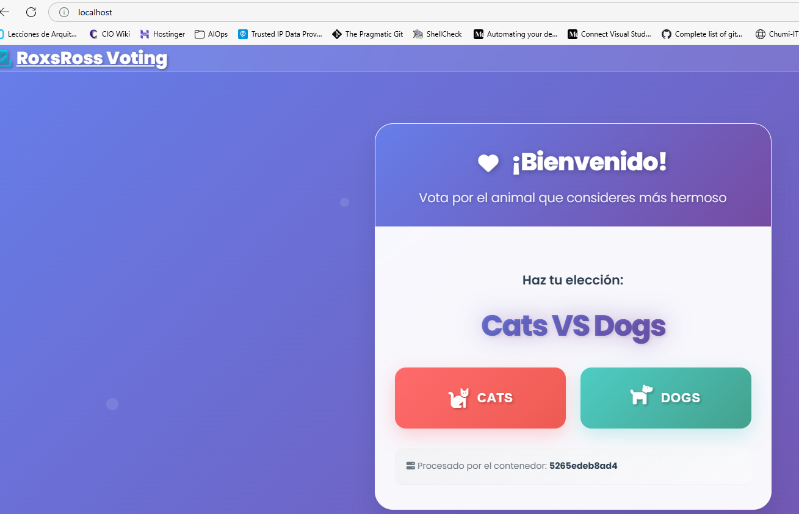
  - Página de resultados:
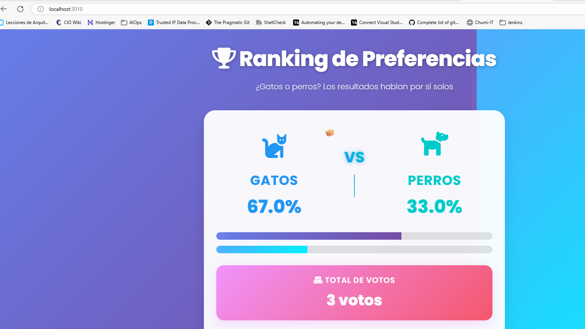

  - El volumen para PostgreSQL:
```console
╰─○ docker volume inspect week2_challenge_postgres_data
[
    {
        "CreatedAt": "2025-07-05T16:14:17Z",
        "Driver": "local",
        "Labels": {
            "com.docker.compose.config-hash": "5df5a9c200df726c80c871501950005fcf9d1444a79af536fd4b2b70af5bc7cc",
            "com.docker.compose.project": "week2_challenge",
            "com.docker.compose.version": "2.34.0",
            "com.docker.compose.volume": "postgres_data"
        },
        "Mountpoint": "/var/lib/docker/volumes/week2_challenge_postgres_data/_data",
        "Name": "week2_challenge_postgres_data",
        "Options": null,
        "Scope": "local"
    }
]
```
  - Finalmente, la estructura del proyecto:
```console
╰─○ eza -lahT
Permissions Size User     Date Modified Name
drwxrwxrwx     - clansman  5 Jul 10:27  .
.rwxrwxrwx     0 clansman  4 Jul 10:51  ├── .dockerignore
.rwxrwxrwx  2.6k clansman  7 Jul 09:09  ├── docker-compose.yml
.rwxrwxrwx  1.3k clansman  5 Jul 10:52  ├── launch.sh
drwxrwxrwx     - clansman  7 Jul 11:23  ├── logs
.rwxrwxrwx  2.2k clansman  5 Jul 11:33  │  ├── stack_20250705_113301.log
.rwxrwxrwx  1.3k clansman  7 Jul 09:11  │  ├── stack_20250707_091023.log
.rwxrwxrwx  1.4k clansman  7 Jul 11:10  │  ├── stack_20250707_110954.log
.rwxrwxrwx  1.4k clansman  7 Jul 11:24  │  └── stack_20250707_112319.log
drwxrwxrwx     - clansman  4 Jul 10:55  ├── nginx
.rwxrwxrwx   887 clansman  5 Jul 09:26  │  └── nginx.conf
drwxrwxrwx     - clansman  4 Jul 14:22  ├── postgres
.rwxrwxrwx    73 clansman  5 Jul 09:20  │  ├── .env
.rwxrwxrwx   157 clansman  5 Jul 09:23  │  └── init.sql
drwxrwxrwx     - clansman  4 Jul 10:54  ├── redis
.rwxrwxrwx     0 clansman  4 Jul 10:54  │  └── redis.conf
drwxrwxrwx     - clansman  5 Jul 10:28  ├── result
.rwxrwxrwx   170 clansman  7 Jul 11:22  │  ├── .env
.rwxrwxrwx   577 clansman  5 Jul 10:29  │  ├── Dockerfile
drwxrwxrwx     - clansman  5 Jul 10:28  │  └── result
.rwxrwxrwx     8 clansman 11 Jun 15:44  │     ├── .nvmrc
.rwxrwxrwx  6.3k clansman 27 Jun 07:31  │     ├── main.js
.rwxrwxrwx   822 clansman 11 Jun 15:44  │     ├── package.json
drwxrwxrwx     - clansman  5 Jul 10:28  │     ├── tests
.rwxrwxrwx   134 clansman 11 Jun 15:44  │     │  └── main.test.js
drwxrwxrwx     - clansman  5 Jul 10:28  │     └── views
.rwxrwxrwx  6.1k clansman 11 Jun 15:44  │        ├── .DS_Store
.rwxrwxrwx  5.1k clansman 11 Jun 15:44  │        ├── index.html
drwxrwxrwx     - clansman  5 Jul 10:28  │        ├── js
.rwxrwxrwx  151k clansman 11 Jun 15:44  │        │  ├── angular.min.js
.rwxrwxrwx  5.1k clansman 11 Jun 15:44  │        │  ├── app.js
.rwxrwxrwx   50k clansman 11 Jun 15:44  │        │  └── socket.io.js
drwxrwxrwx     - clansman  5 Jul 10:28  │        └── stylesheets
.rwxrwxrwx   16k clansman 11 Jun 15:44  │           └── style.css
.rwxrwxrwx   365 clansman  5 Jul 09:53  ├── shutdown.sh
drwxrwxrwx     - clansman  4 Jul 10:55  ├── volumes
drwxrwxrwx     - clansman  4 Jul 10:55  │  └── db_data
drwxrwxrwx     - clansman  4 Jul 16:36  ├── vote
.rwxrwxrwx   426 clansman  5 Jul 11:17  │  ├── .env
.rwxrwxrwx   871 clansman  5 Jul 10:36  │  ├── Dockerfile
.rwxrwxrwx   136 clansman  4 Jul 16:26  │  ├── requirements.txt
drwxrwxrwx     - clansman  5 Jul 10:42  │  └── vote
.rwxrwxrwx     0 clansman  5 Jul 10:42  │     ├── __init__.py
.rwxrwxrwx  8.4k clansman 11 Jun 15:44  │     ├── app.py
drwxrwxrwx     - clansman  4 Jul 16:27  │     ├── templates
.rwxrwxrwx   25k clansman 11 Jun 15:44  │     │  └── index.html
drwxrwxrwx     - clansman  4 Jul 16:27  │     └── tests
.rwxrwxrwx   468 clansman 11 Jun 15:44  │        ├── lint_test.py
.rwxrwxrwx   250 clansman 11 Jun 15:44  │        └── test_app.py
drwxrwxrwx     - clansman  5 Jul 10:12  └── worker
.rwxrwxrwx   195 clansman  7 Jul 10:48     ├── .env
.rwxrwxrwx   216 clansman  5 Jul 10:22     ├── Dockerfile
drwxrwxrwx     - clansman  5 Jul 08:09     └── worker
.rwxrwxrwx     8 clansman 11 Jun 15:44        ├── .nvmrc
.rwxrwxrwx  7.5k clansman 27 Jun 07:27        ├── main.js
.rwxrwxrwx   561 clansman 11 Jun 15:44        ├── package.json
drwxrwxrwx     - clansman  5 Jul 08:09        └── tests
.rwxrwxrwx   125 clansman 11 Jun 15:44           └── main.test.js
```