<span style="color:blue;font-weight:700;font-size:18px">
    <h1>
        SEMANA 3. CI/CD - GITHUB ACTIONS
    </h1>
</span>

<span style="color:green;font-weight:400;font-size:16px">
    <h2>
        Día 15 - Primer CI/CD pipeline con Github Actions.
    </h2>
</span>

Habiendo trabajado previamente con Gitlab, comprender la idea detrás de Github Actions fue sencillo. Existen los mismos conceptos: workflow, jobs, tasks, runners, triggers, etc.

En Github Actions, empecé por crear el repositorio, clonarlo localmente, añadir la estructura sugerida por Rossana, crear el Workflow, añadir el directorio con *Git*, hacer `git commit` y hacer `git push`.

El resultado es el siguiente:

```console
╰─○ eza -lahT
Permissions Size User     Date Modified Name
drwxrwxrwx     - clansman  8 Jul 11:05  .
drwxrwxrwx     - clansman  8 Jul 11:07  ├── githubActions1
drwxrwxrwx     - clansman  8 Jul 11:25  │  ├── .git
drwxrwxrwx     - clansman  8 Jul 11:07  │  ├── .github
drwxrwxrwx     - clansman  8 Jul 11:08  │  │  └── workflows
.rwxrwxrwx   582 clansman  8 Jul 11:15  │  │     └── hola-mundo.yml
.rwxrwxrwx    17 clansman  8 Jul 11:06  │  └── ghactions1Readme.md
.rwxrwxrwx   128 clansman  8 Jul 10:45  └── README.md
```
El pipeline ya ejecutado correctamente:
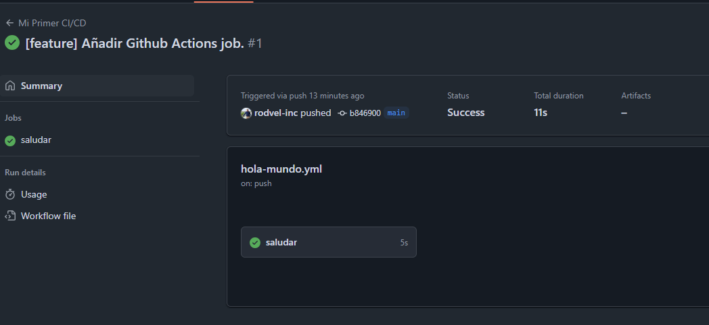

De gran importancia, es definir cuáles son los eventos (triggers) que generan la ejecución del *pipeline*. Para el caso de este primer ejercicio, se define que son 2 eventos específicos: al hacer `git push` a la rama *main* o al hacer un *pull request* o *merge request* (como lo conocí en Gitlab) a la rama *main*.

```yaml
on:
  push:
    branches: [ main ]
  pull_request:
    branches: [ main ]
```
<span style="color:green;font-weight:400;font-size:14px">
    <h3>
        Día 15 - Ejercicios Prácticos
    </h3>
</span>

**Ejercicio 1**
Evidencias

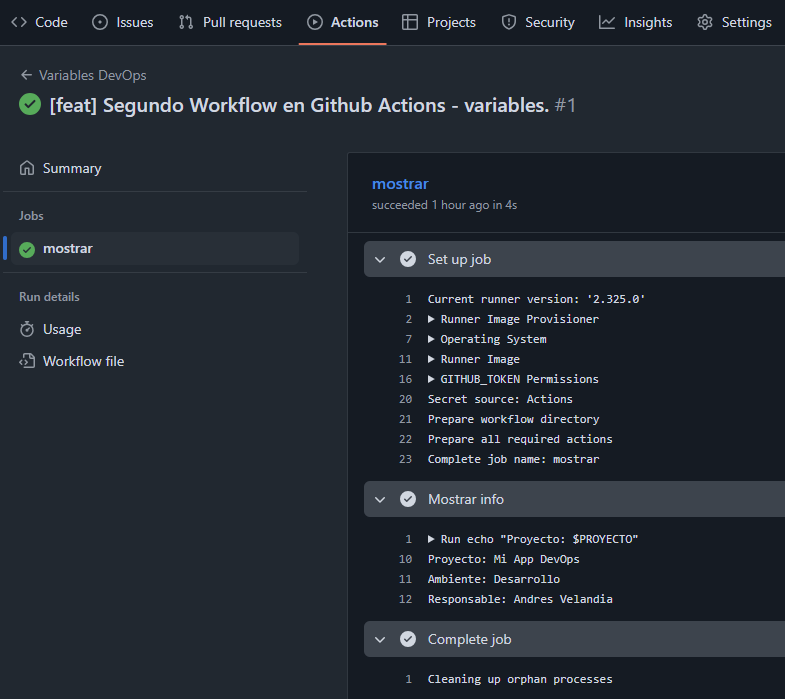

**Ejercicio 2**
Evidencia:

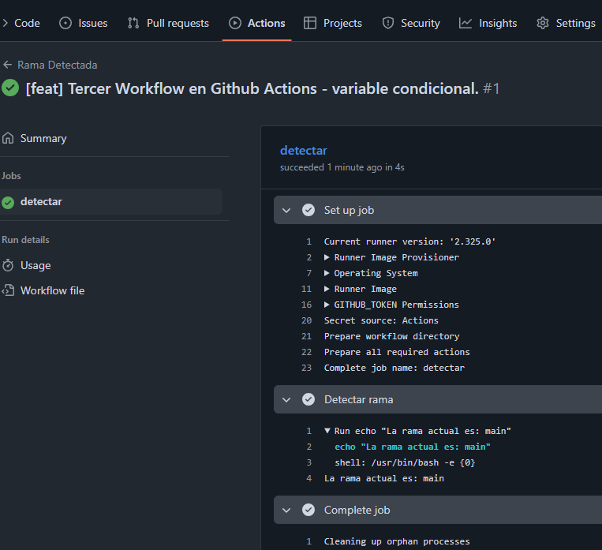

<span style="color:green;font-weight:400;font-size:16px">
    <h2>
        Día 16 - Build y Testing Básico.
    </h2>
</span>

Se propone una aplicación en Python sobre la cual se ejecuta una serie de pruebas automáticas de código. Me enfoqué primero en ejecutar el workflow "as-is" y presentó varios mensajes de error. Después de hacer varias correcciones, llegué hasta este punto en el cual falla una de las pruebas incluidas en `test-app.py`:

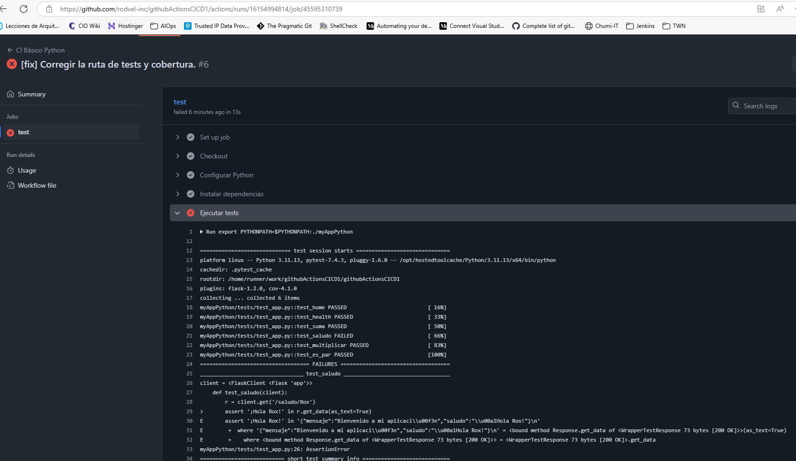

Al finalizar la solución de errores, logré que el workflow funcione correctamente:

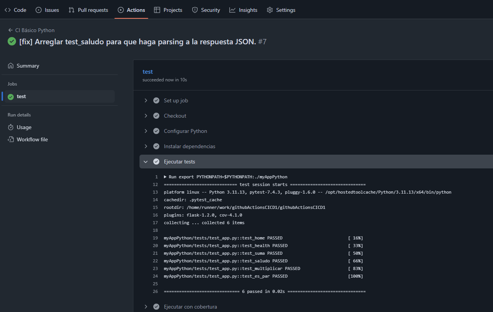

Sin embargo, considero que esta tarea de hacer que funcione sin errores es irrelevante en este punto; lo realmente importante aquí es ser conciente de las capacidades de Github Actions, particularmente la inclusión de pruebas que pueden ser ejecutadas automáticamente dentro del flujo.

<span style="color:green;font-weight:400;font-size:16px">
    <h2>
        Día 17 - Docker Build Básico
    </h2>
</span>

Antes de ejecutar esta tarea, me hice las preguntas: ¿Por qué quisiera correr un contenedor Docker dentro de un runner de Github? ¿No es un esfuerzo extra e innecesario, dado que el runner, en sí mismo, ya es un contenedor?

La respuesta es: una imagen de Docker es la que me permitirá desplegar posteriormente en producción o staging; al construirla y correrla en la etapa CI de un *pipeline* me puedo asegurar de que la imagen funciona como lo necesito: dependencias, entorno, puertos, permisos, etc. En resumen, **es buena práctica probar mi artefacto de despliegue.**

Aquí está la evidencia de su funcionamiento correcto al ejecutar el workflow correspondiente:

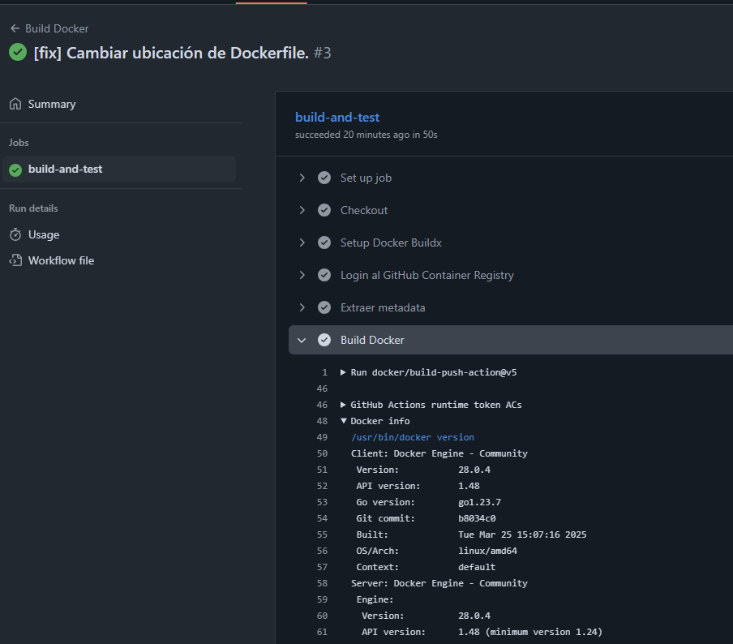

<span style="color:green;font-weight:400;font-size:16px">
    <h2>
        Día 18 - Self-hosted Runner Básico
    </h2>
</span>

**Ejercicio 1**

- Configurar y usar un Github runner hospedado en la máquina local. En experiencias anteriores, había hecho lo mismo con Gitlab. 
- Usar un runner local tiene varias ventajas, pero la más relevante en mi opinión personal es tener un sistema que uno puede manipular y controlar completamente, en un entorno que más adaptado a la realidad de las necesidades personales.

Evidencia desde el runner local:
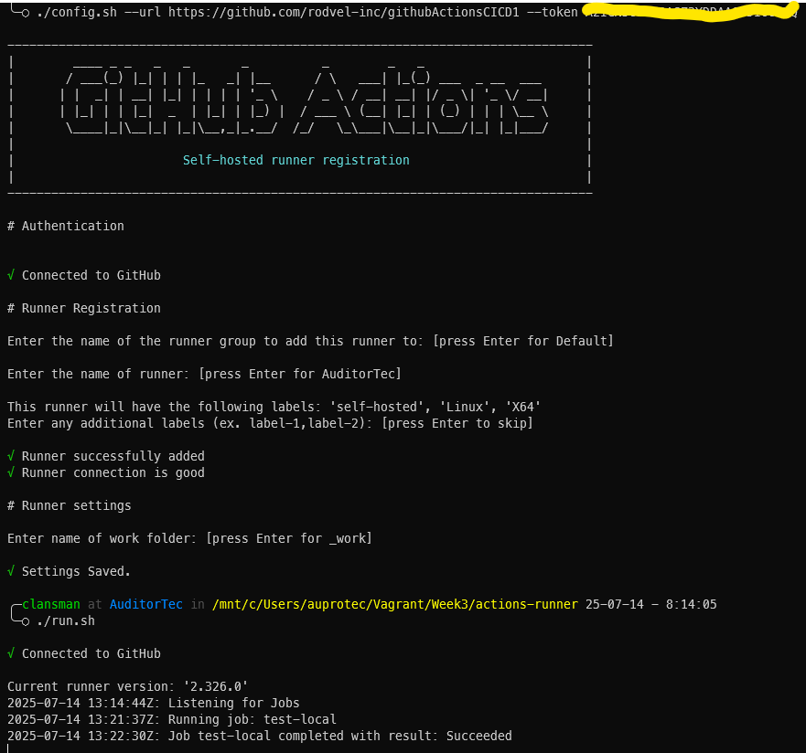

Evidencia desde Github Actions:
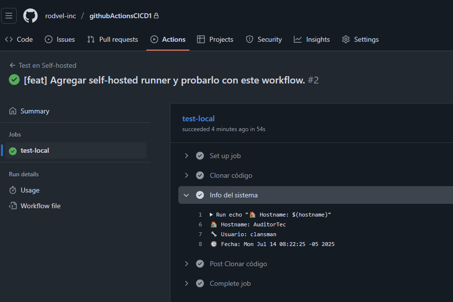

**Ejercicio 2**
- Al runner del ejercicio anterior, agregar la construcción y ejecución de un contenedor Docker en su interior.
- Una duda que me asaltó inmediatamente fue: ¿de dónde va a obtener el Dockerfile el workflow propuesto por Rossana? La respuesta es: de la raíz del repositorio de Github para el cual ha sido creado el runner.
- Esta pregunta me surgió porque yo lo estaba viendo desde la perspectiva desde la máquina local en donde tengo el runner, lo cual era erróneo.

Evidencia desde el runner local:
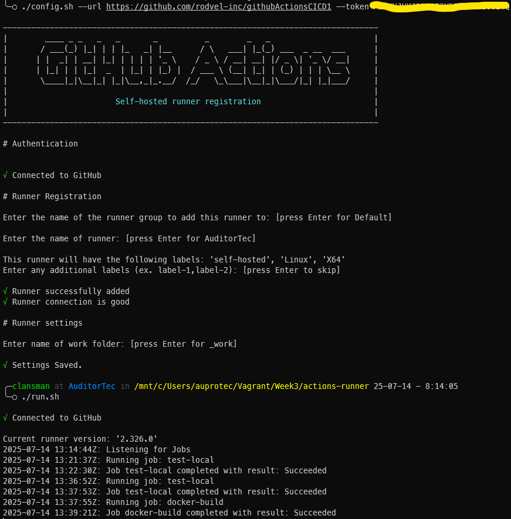

Evidencia desde Github Actions:
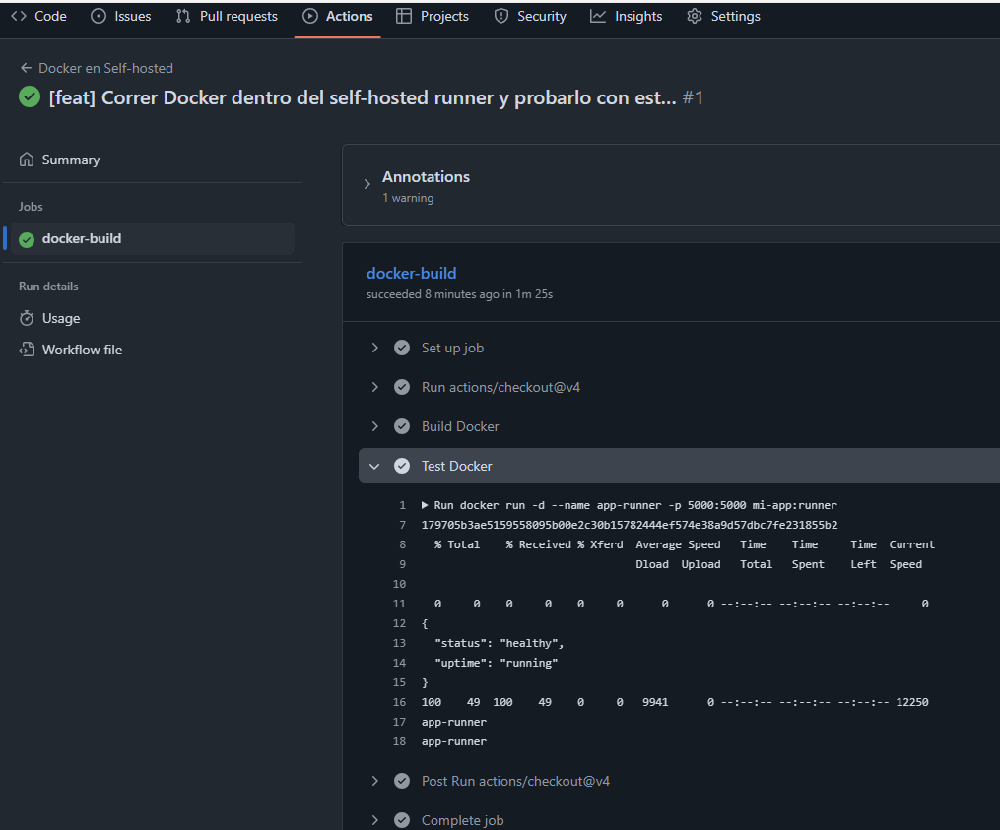

<span style="color:green;font-weight:400;font-size:16px">
    <h2>
        Día 19 - Docker Compose dentro del Self-hosted Runner
    </h2>
</span>

- Instalé Github CLI por primera vez para crear un nuevo repositorio desde mi máquina local, en lugar de hacerlo como siempre lo he hecho: crear un repositorio vacío en Github y luego clonarlo desde mi máquina local.
- Utilicé el proyecto final de la Semana 2, dado que utiliza Docker compose y es un código fuente funcional.

**Evidencia desde el runner local:**
- Contenedores en ejecución:
```console
╰─⠠⠵ docker ps -a
CONTAINER ID   IMAGE                   COMMAND                  CREATED         STATUS                     PORTS                    NAMES
e2500bbbf54d   nginx:alpine            "/docker-entrypoint.…"   3 minutes ago   Up 2 minutes (healthy)     0.0.0.0:80->80/tcp       nginx
cc0f9ae4ef2b   githubactions2-vote     ".venv/bin/flask run…"   3 minutes ago   Up 2 minutes               0.0.0.0:8080->8080/tcp   vote
c712f1bf9c2d   githubactions2-worker   "docker-entrypoint.s…"   3 minutes ago   Up 2 minutes (unhealthy)   0.0.0.0:3000->3000/tcp   worker
18eee3e627c9   githubactions2-result   "docker-entrypoint.s…"   3 minutes ago   Up 2 minutes (unhealthy)   0.0.0.0:3010->3010/tcp   result
f475555d1e24   postgres:15             "docker-entrypoint.s…"   3 minutes ago   Up 3 minutes (healthy)     0.0.0.0:5432->5432/tcp   postgres
12ed6c4d31ac   redis:7                 "docker-entrypoint.s…"   3 minutes ago   Up 3 minutes (healthy)     6379/tcp                 redis
```
- Validación del Container ID que aparece en el frontend de la aplicación de Votos corresponde al contenedor Vote:

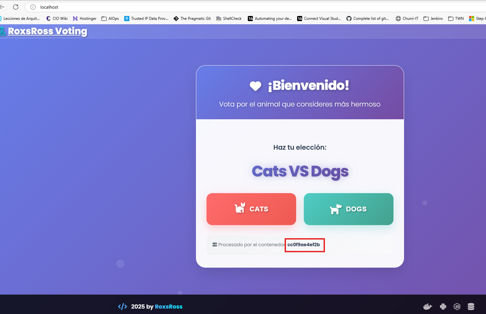

- Estructura del proyecto:
```console
╰─⠠⠵ eza -lahT
Permissions Size User     Date Modified Name
drwxrwxrwx     - clansman 14 Jul 10:10  .
drwxrwxrwx     - clansman 14 Jul 10:53  ├── .git
drwxrwxrwx     - clansman 14 Jul 10:04  ├── .github
drwxrwxrwx     - clansman 14 Jul 10:05  │  └── workflows
.rwxrwxrwx   480 clansman 14 Jul 10:30  │     └── deployment.yml
.rwxrwxrwx  2.4k clansman 14 Jul 10:35  ├── docker-compose.yml
drwxrwxrwx     - clansman 14 Jul 10:03  ├── nginx
.rwxrwxrwx   887 clansman  5 Jul 09:26  │  └── nginx.conf
drwxrwxrwx     - clansman 14 Jul 10:03  ├── postgres
.rwxrwxrwx    73 clansman  5 Jul 09:20  │  ├── .env
.rwxrwxrwx   157 clansman  5 Jul 09:23  │  └── init.sql
drwxrwxrwx     - clansman 14 Jul 10:03  ├── redis
.rwxrwxrwx     0 clansman  4 Jul 10:54  │  └── redis.conf
drwxrwxrwx     - clansman 14 Jul 10:03  ├── result
.rwxrwxrwx   170 clansman  7 Jul 11:22  │  ├── .env
.rwxrwxrwx   577 clansman  5 Jul 10:29  │  ├── Dockerfile
drwxrwxrwx     - clansman 14 Jul 10:03  │  └── result
.rwxrwxrwx     8 clansman 11 Jun 15:44  │     ├── .nvmrc
.rwxrwxrwx  6.3k clansman 27 Jun 07:31  │     ├── main.js
.rwxrwxrwx   822 clansman 11 Jun 15:44  │     ├── package.json
drwxrwxrwx     - clansman 14 Jul 10:03  │     ├── tests
.rwxrwxrwx   134 clansman 11 Jun 15:44  │     │  └── main.test.js
drwxrwxrwx     - clansman 14 Jul 10:03  │     └── views
.rwxrwxrwx  6.1k clansman 11 Jun 15:44  │        ├── .DS_Store
.rwxrwxrwx  5.1k clansman 11 Jun 15:44  │        ├── index.html
drwxrwxrwx     - clansman 14 Jul 10:03  │        ├── js
.rwxrwxrwx  151k clansman 11 Jun 15:44  │        │  ├── angular.min.js
.rwxrwxrwx  5.1k clansman 11 Jun 15:44  │        │  ├── app.js
.rwxrwxrwx   50k clansman 11 Jun 15:44  │        │  └── socket.io.js
drwxrwxrwx     - clansman 14 Jul 10:03  │        └── stylesheets
.rwxrwxrwx   16k clansman 11 Jun 15:44  │           └── style.css
drwxrwxrwx     - clansman 14 Jul 10:03  ├── vote
.rwxrwxrwx   426 clansman  5 Jul 11:17  │  ├── .env
.rwxrwxrwx   871 clansman  5 Jul 10:36  │  ├── Dockerfile
.rwxrwxrwx   136 clansman  4 Jul 16:26  │  ├── requirements.txt
drwxrwxrwx     - clansman 14 Jul 10:04  │  └── vote
.rwxrwxrwx     0 clansman  5 Jul 10:42  │     ├── __init__.py
.rwxrwxrwx  8.4k clansman 11 Jun 15:44  │     ├── app.py
drwxrwxrwx     - clansman 14 Jul 10:03  │     ├── templates
.rwxrwxrwx   25k clansman 11 Jun 15:44  │     │  └── index.html
drwxrwxrwx     - clansman 14 Jul 10:04  │     └── tests
.rwxrwxrwx   468 clansman 11 Jun 15:44  │        ├── lint_test.py
.rwxrwxrwx   250 clansman 11 Jun 15:44  │        └── test_app.py
drwxrwxrwx     - clansman 14 Jul 10:04  └── worker
.rwxrwxrwx   195 clansman  7 Jul 10:48     ├── .env
.rwxrwxrwx   216 clansman  5 Jul 10:22     ├── Dockerfile
drwxrwxrwx     - clansman 14 Jul 10:04     └── worker
.rwxrwxrwx     8 clansman 11 Jun 15:44        ├── .nvmrc
.rwxrwxrwx  7.5k clansman 27 Jun 07:27        ├── main.js
.rwxrwxrwx   561 clansman 11 Jun 15:44        ├── package.json
drwxrwxrwx     - clansman 14 Jul 10:04        └── tests
.rwxrwxrwx   125 clansman 11 Jun 15:44           └── main.test.js
```
**Evidencia desde Github Actions:**
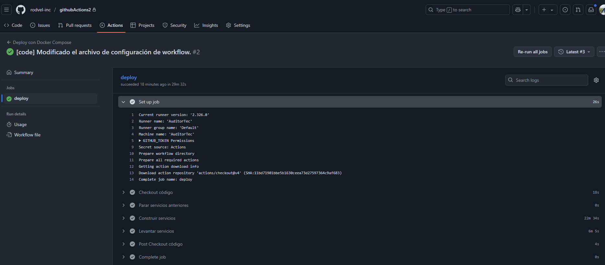

<span style="color:green;font-weight:400;font-size:16px">
    <h2>
        Día 20 - Monitoreo Github Actions
    </h2>
</span>

Inicialmente, pasé de largo las actividades de este día, pues consideraba que ya tengo mucha experiencia con tareas de monitoreo y logging en general.

Sin embargo, cuando empecé a naufragar en el desafío final de la Semana 3, me di cuenta del error que había cometido. Cuando quise hacer las pruebas de integración empecé a encontrar un obstáculo aparentemente infranqueable, pues continuamente fallaban todas las tareas de salud de los contenedores (healthcheck). 

Tuve que volver al principio, a revisar en qué consiste exactamente este tipo de validaciones, para qué son útiles y por qué deben ser parte del proceso de construcción de las imágenes y despliegue de los contenedores. 

**La importancia de los _healthcheck_**
Uno elige una imagen, despliega el contenedor, la aplicación en su interior corre bien, sin problemas, pero puede fallar y uno puede no darse cuenta de este evento. Empieza a hacer troubleshooting y ve que el contenedor está operativo. ¿Cómo ver al interior de éste desde el punto de vista de la aplicación?

Esta es la razón de ser de la instrucción _healthcheck_. Se puede ejecutar periódicamente.

Por defecto, Docker no realiza estas inspecciones. Es por eso que se deben declarar explícitamente.

Si un contenedor no pasa la prueba de salud, es marcado como _unhealthy_ y cualquier tráfico que sea enviado a éste será bloqueado por Docker.

<span style="color:green;font-weight:400;font-size:16px">
    <h2>
        Día 21 - Desafío Final - Semana 3
    </h2>
</span>

🎯 *Objetivo:*

Crear un pipeline CI/CD completo para el proyecto roxs-voting-app de la Semana 2, integrando todos los conceptos aprendidos en la Semana 3:

- GitHub Actions workflows
- Self-hosted runners
- Build y push de imágenes Docker
- Deployment automático con Docker Compose
- Health checks y monitoreo básico

🧠 **¿Qué aprendí?**
Obviamente, a medida que se van añadiendo conceptos y tecnologías a la receta original, el nivel de complejidad va aumentando exponencialmente. Los principales aprendizajes que surgen de este desafío son:
- La importancia de planear la construcción del *pipeline* antes de hacer cualquier configuración o escribir una línea de código: esto permite tener un plan, identificar los hitos que se deben alcanzar, entender los pasos que se deben dar para llegar a cada uno de ellos.
- Entender cómo cada hito depende de haber logrado exitosamente el anterior, pues en este punto del Desafío ya existen claras dependencias entre artefactos; por ejemplo, las pruebas unitarias deben ser exitosas antes de ejecutar pruebas de cobertura de código, las cuales deben ser exitosas antes de agregar las pruebas de integración, y así sucesivamente.
- A pesar de que la promesa de valor del uso de los contenedores es que se evita el escenario de decir "en mi máquina si funcionaba", hay detalles que parecen irrelevantes al pasar de un Docker en la máquina local a un *Github Runner*. Este último tiene menos capacidad de cómputo que la que uno puede asignar a Docker local, y en general tiene limitaciones - supongo yo - derivadas de su carácter gratuito.
- La importancia de construir imágenes de contenedor diferenciadas para entornos productivos y no productivos. Los expertos llaman "hygiene" a la buena práctica de eliminar y/o optimizar pasos en los Dockerfile para la construcción de las imágenes de los contenedores de entornos productivos; por ejemplo:
  - en entorno de desarrollo se exponen los puertos TCP de todos los contenedores para efectos de probar y verificar exhaustivamente, pero para entornos productivos solamente se exponen los puertos de aquellos contenedores que realmente lo requieren,
  - hay dependencias de Node.js o Python que se requieren para desarrollo y no se requieren para producción,
  - esta optimización se traduce en la reducción del tamaño de la imagen resultante, lo cual tiene impactos positivos en otras tareas del despliegue de un entorno de aplicación.
- **Construir un CI/CD pipeline es una obra de amor**: requiere paciencia, constancia, concentración, atención al detalle, leer y leer, fallar mil veces para tener éxito en una; por ejemplo, tuve que lanzar y fallar 16 veces el *workflow* de CI (pruebas unitarias + healthcheck + pruebas de integración) antes de lograr una ejecución exitosa:

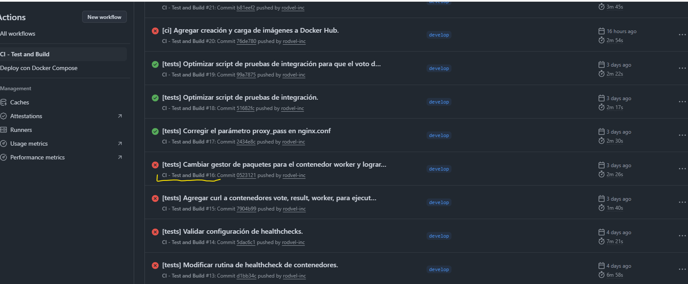

- **La importancia superlativa de comprender exactamente qué sucede en cada paso**. ¿Para qué sirve hacer el healthcheck de los contenedores?, ¿qué estoy midiendo con el análisis de cobertura de las pruebas unitarias?, ¿qué puedo hacer con cada artefacto que se produce en cada etapa?, ¿en qué punto del proceso ya tengo un *release candidate*?, ¿en qué punto del proceso ya tengo el artefacto listo para producción?, etc.
- Que existen muchos eventos que disparan la ejecución de *workflows* en Github Actions, y que cada evento tiene sus condiciones específicas en las cuales pueden generar el resultado esperado. Por ejemplo, en mi caso personal, tengo el siguiente escenario:
  - un *workflow* definido en un archivo llamado `ci.yml`, el cual he estado modificando mientras estoy en la rama `develop`.
  - un *workflow* definido en un archivo llamado `deploy-staging.yml`, el cual también he estado modificando mientras estoy en la rama `develop`.
  - el primero de estos ejecuta las siguientes acciones en un *runner* de Github:
    - pruebas unitarias
    - pruebas de *healthcheck* de los contenedores
    - pruebas de integración
    - construcción de imágenes de contenedores
    - carga de imágenes en *Docker Hub*.
  - el segundo de estos ejecuta el auto-deploy de los contenedores en un entorno de *staging*, sólo si el primer *workflow* se ejecuta exitosamente.
- Existen 2 maneras de lograr esta secuencia de ejecución de *workflows*:
  - estrategia **Personal Access Token (PAT)**
  - estrategia **workflow-run**
- Probé las 2 estrategias y decidí quedarme conla segunda; pero tiene un detalle importante que hizo las cosas más difíciles de lo esperado. De acuerdo con la documentación oficial de Github Actions, el evento **workflow_dispatch**: "...will only trigger a workflow run if the workflow file exists on the default branch."
- Hasta este punto, he trabajado todo el tiempo en la rama *develop*, y esta no es la rama por defecto de mi repositorio, lo cual ha dificultado enormemente el desarrollo del desafío.   
- Finalmente, logré cambiar la rama *default* temporalmente, probé la ejecución de los flujos correspondientes a la rama *develop*, como se puede ver en estas evidencias.
- Ejecución del workflow **CI/CD**:

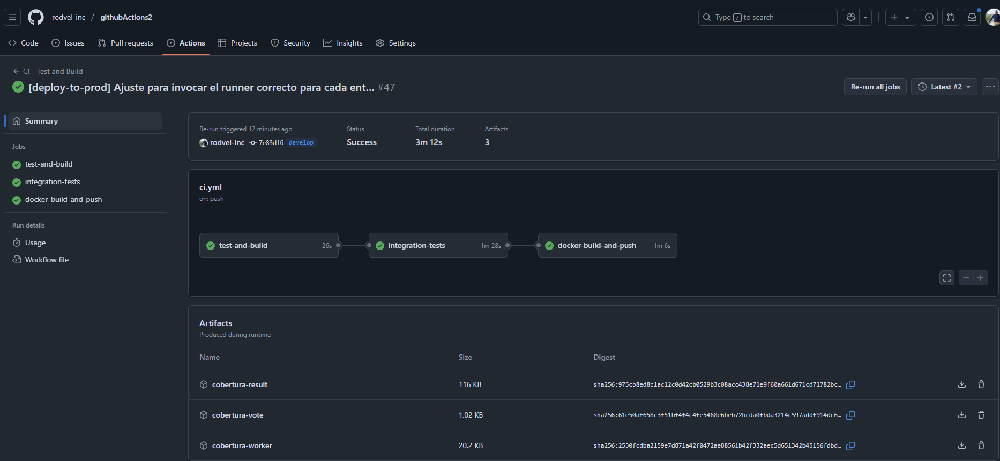

- Ejecución del workflow **Auto-deploy a Staging**:

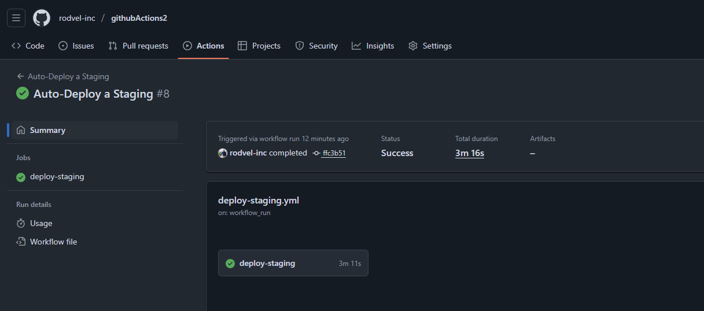

- Ejecución del workflow **Deploy a Produccion** después de aprobar manualmente:

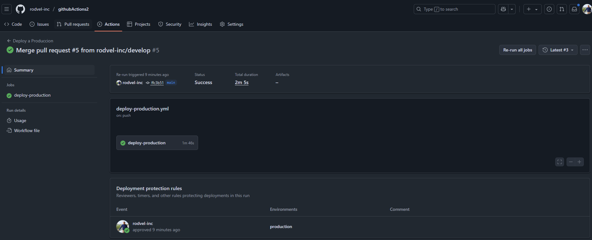

- *Self-hosted runner* con etiquetas [self-hosted, staging] con ejecución exitosa del *workflow* **Auto-deploy a Staging**:

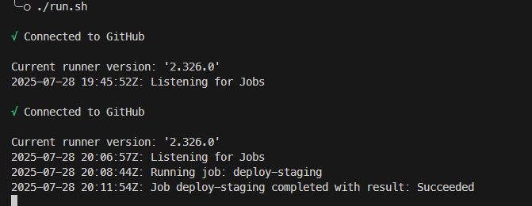

- *Self-hosted runner* con etiquetas [self-hosted, prod] con ejecución exitosa del *workflow* **Deploy a Produccion**:

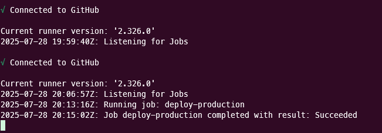

- Runners configurados en Github Actions:

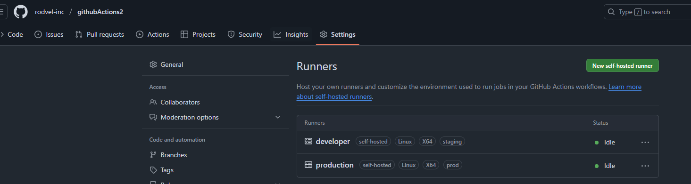
- Contenedores del ambiente de Producción desplegados correctamente:
```console
prodrunner@AuditorTec:~$ docker ps -a
CONTAINER ID   IMAGE                     COMMAND                  CREATED          STATUS                        PORTS                                         NAMES
3c22505aaea3   nginx:alpine              "/docker-entrypoint.…"   15 minutes ago   Up 15 minutes (healthy)       0.0.0.0:80->80/tcp, [::]:80->80/tcp           nginx
57e32244e10e   rodvelinc/vote:latest     ".venv/bin/flask run…"   15 minutes ago   Up 15 minutes (healthy)       0.0.0.0:8080->80/tcp, [::]:8080->80/tcp       githubactions2-vote-1
15bee0fa70c1   rodvelinc/result:latest   "docker-entrypoint.s…"   15 minutes ago   Up 15 minutes (healthy)       0.0.0.0:3010->3010/tcp, [::]:3010->3010/tcp   githubactions2-result-1
aabc00c3c410   rodvelinc/worker:latest   "docker-entrypoint.s…"   15 minutes ago   Up 15 minutes (healthy)                                                     githubactions2-worker-1
7c73225f838e   postgres:15               "/bin/bash -c /scrip…"   15 minutes ago   Exited (127) 15 minutes ago                                                 postgres_backup
bd1162d14cef   postgres:15               "docker-entrypoint.s…"   15 minutes ago   Up 15 minutes (healthy)       0.0.0.0:5432->5432/tcp, [::]:5432->5432/tcp   postgres
5aa029d3e124   redis:7                   "docker-entrypoint.s…"   3 days ago       Up 15 minutes (healthy)       6379/tcp                                      redis
```
- Evidencias de la máquina host (Ubuntu 22.04), corriendo sobre WSL2, en la cual se está ejecutando el runner de Producción:
```console
prodrunner@AuditorTec:~$ sudo ss -tulpn | grep docker
tcp   LISTEN 0      4096          0.0.0.0:8080      0.0.0.0:*    users:(("docker-proxy",pid=5106,fd=7))
tcp   LISTEN 0      4096          0.0.0.0:3010      0.0.0.0:*    users:(("docker-proxy",pid=5138,fd=7))
tcp   LISTEN 0      4096          0.0.0.0:5432      0.0.0.0:*    users:(("docker-proxy",pid=4849,fd=7))
tcp   LISTEN 0      4096          0.0.0.0:80        0.0.0.0:*    users:(("docker-proxy",pid=5234,fd=7))
tcp   LISTEN 0      4096             [::]:8080         [::]:*    users:(("docker-proxy",pid=5113,fd=7))
tcp   LISTEN 0      4096             [::]:3010         [::]:*    users:(("docker-proxy",pid=5151,fd=7))
tcp   LISTEN 0      4096             [::]:5432         [::]:*    users:(("docker-proxy",pid=4858,fd=7))
tcp   LISTEN 0      4096             [::]:80           [::]:*    users:(("docker-proxy",pid=5242,fd=7))
```
- Evidencias de la estructura de archivos del proyecto:
```console
 eza -lhT -L=1
Permissions Size User       Date Modified Name
.rwxrwxrwx  2.6k prodrunner 28 Jul 08:22  docker-compose.prod.yml
.rwxrwxrwx  2.5k prodrunner 24 Jul 07:50  docker-compose.staging.yml
.rwxrwxrwx  2.6k prodrunner 16 Jul 11:02  docker-compose.yml
drwxrwxrwx     - prodrunner 16 Jul 14:01  logs
drwxrwxrwx     - prodrunner 14 Jul 10:03  nginx
.rwxrwxrwx   885 prodrunner 16 Jul 13:40  └── nginx.conf
drwxrwxrwx     - prodrunner 14 Jul 10:03  postgres
.rwxrwxrwx   157 prodrunner  5 Jul 09:23  └── init.sql
drwxrwxrwx     - prodrunner 14 Jul 10:03  redis
.rwxrwxrwx     0 prodrunner  4 Jul 10:54  └── redis.conf
drwxrwxrwx     - prodrunner 18 Jul 09:55  result
.rwxrwxrwx   665 prodrunner 16 Jul 11:35  ├── Dockerfile
.rwxrwxrwx   665 prodrunner 18 Jul 12:55  ├── Dockerfile.result.test
.rwxrwxrwx  6.3k prodrunner 27 Jun 07:31  ├── main.js
drwxrwxrwx     - prodrunner 15 Jul 10:38  ├── node_modules
.rwxrwxrwx  213k prodrunner 15 Jul 10:38  ├── package-lock.json
.rwxrwxrwx   953 prodrunner 15 Jul 11:48  ├── package.json
drwxrwxrwx     - prodrunner 14 Jul 14:42  ├── tests
drwxrwxrwx     - prodrunner 14 Jul 10:03  └── views
drwxrwxrwx     - prodrunner 24 Jul 10:48  scripts
.rwxrwxrwx   297 prodrunner 24 Jul 15:21  ├── backup.sh
.rwxrwxrwx  1.4k prodrunner 16 Jul 14:39  ├── integrationTest.sh
.rwxrwxrwx   952 prodrunner 15 Jul 17:03  └── wait-for-services.sh
drwxrwxrwx     - prodrunner 18 Jul 09:55  vote
.rwxrwxrwx   996 prodrunner 16 Jul 10:56  ├── Dockerfile
.rwxrwxrwx   955 prodrunner 18 Jul 12:54  ├── Dockerfile.vote.test
.rwxrwxrwx   167 prodrunner 14 Jul 15:55  ├── requirements.txt
drwxrwxrwx     - prodrunner 14 Jul 14:28  ├── tests
drwxrwxrwx     - prodrunner 14 Jul 14:56  └── vote
drwxrwxrwx     - prodrunner 18 Jul 10:05  worker
.rwxrwxrwx   281 prodrunner 16 Jul 11:33  ├── Dockerfile
.rwxrwxrwx   268 prodrunner 18 Jul 12:53  ├── Dockerfile.worker.test
.rwxrwxrwx  7.5k prodrunner 27 Jun 07:27  ├── main.js
drwxrwxrwx     - prodrunner 15 Jul 10:35  ├── node_modules
.rwxrwxrwx  212k prodrunner 15 Jul 10:35  ├── package-lock.json
.rwxrwxrwx   691 prodrunner 15 Jul 11:48  ├── package.json
drwxrwxrwx     - prodrunner 14 Jul 14:40  └── tests
```
- Frontend servido por el contenedor correcto:

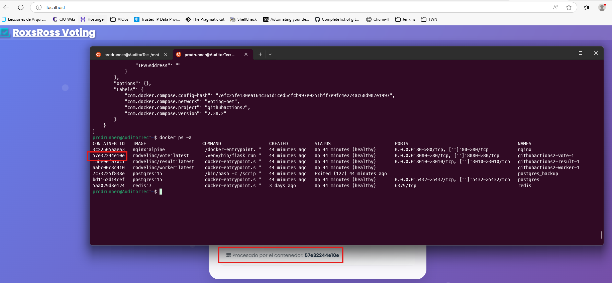

- Contenedor *Result* mostrando los votos correctamente:

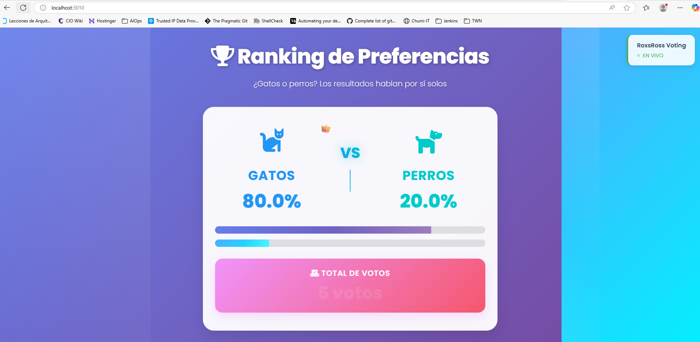

